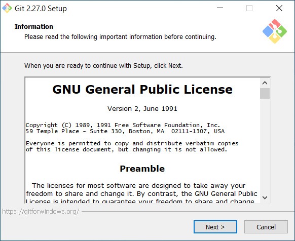
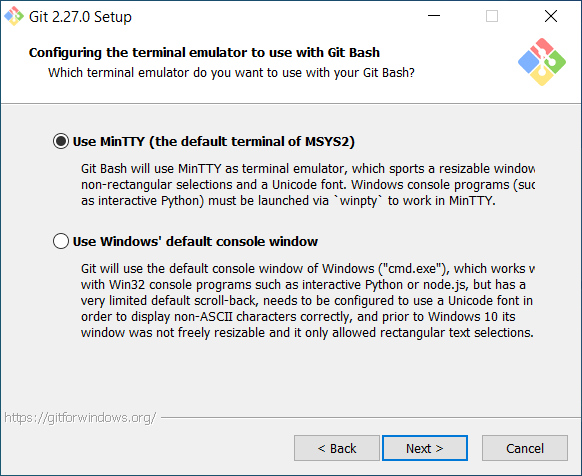

# How to install Git

In this document, I show you how to install Git.

# Requirements

You need to download Git from here: [https://git-scm.com/](https://git-scm.com/).

In this guide, I have installed Git 2.27.0.

# Steps

Follow the below steps to install Git.

## Step 1

Run the Git installer.

When done, you should see the following window:

## Step 2

Left click on the "Next" button.

When done, you should see the following window:

## Step 3

Left click on the "Next" button.

When done, you should see the following window:

## Step 4

Left click on the "Next" button.

When done, you should see the following window:

## Step 5

Left click on the "Next" button.

When done, you should see the following window:

## Step 6

Left click on the "Next" button.

When done, you should see the following window:

## Step 7

Left click on the "Next" button.

When done, you should see the following window:

## Step 8

Left click on the "Next" button.

When done, you should see the following window:

## Step 9

Left click on the "Next" button.

When done, you should see the following window:

## Step 10

Left click on the "Next" button.

When done, you should see the following window:

## Step 11

Left click on the "Next" button.

When done, you should see the following window:

## Step 12

Left click on the "Next" button.

When done, you should see the following window:

## Step 13

Left click on the "Install" button.

When done, you should see the following window:

## Step 14

Left click on the "Next" button.

When done, you should see the following window:

## Step 15

Left click on the "Next" button.

# Conclusion

If you've followed these steps correctly, you have installed Git.

# Credit

Dr Frazer K. Noble  
Department of Mechanical and Electrical Engineering  
Massey University  
Auckland  
New Zealand  