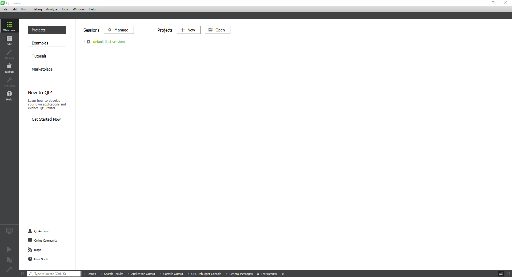
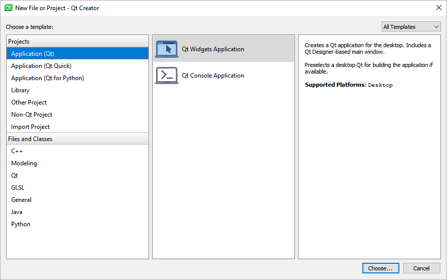
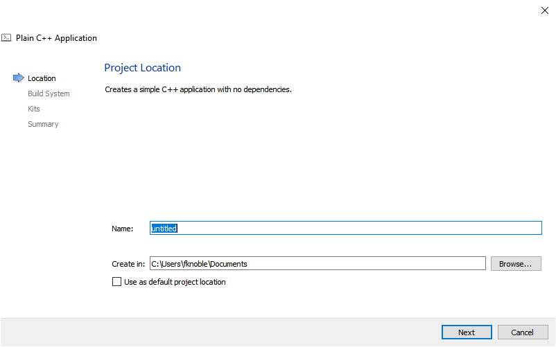
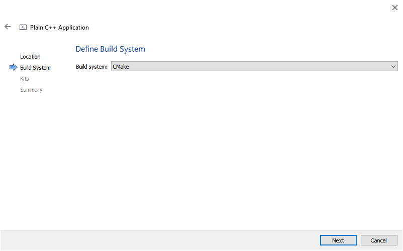
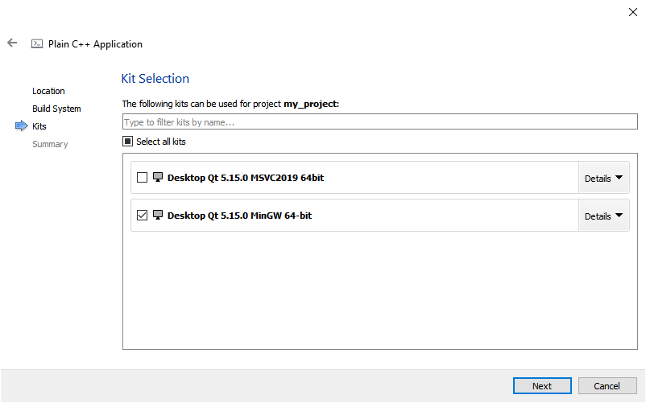
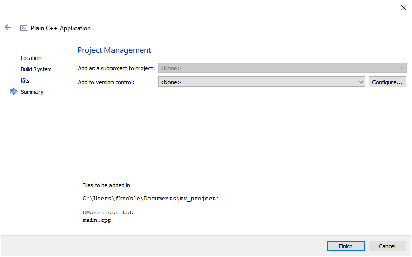
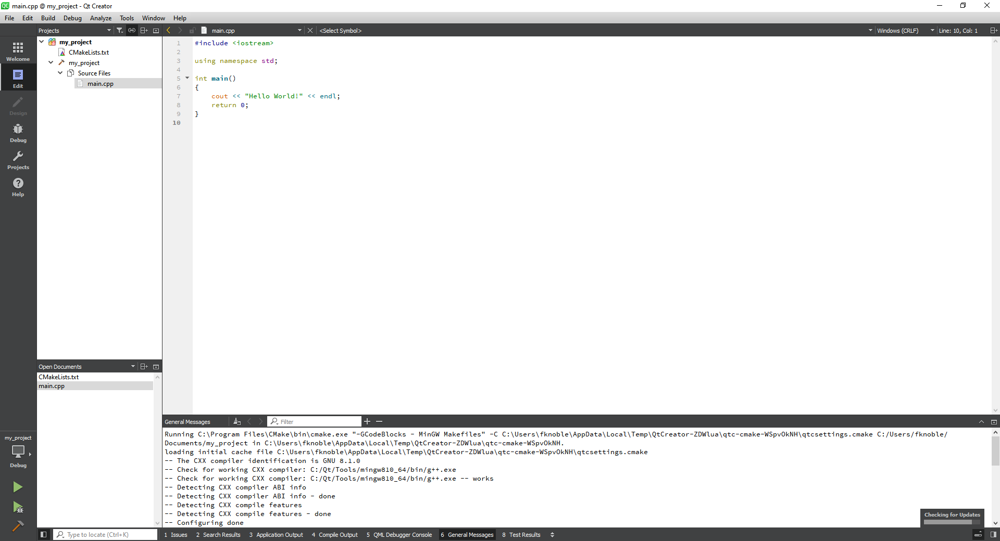
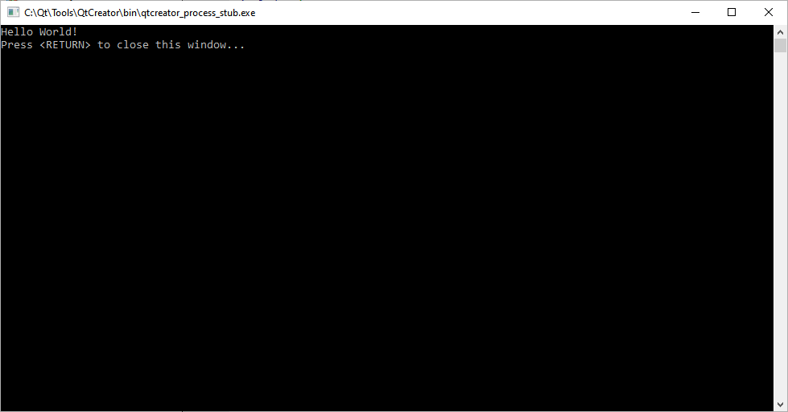

# Creating a new C++ project in Qt Creator

In this guide, I show you how to create a new C++ project in Qt Creator.

# Requirements

You need to have downloaded and installed:

1. Qt 5.15
1. CMake 3.17.3

# Steps

Follow the below steps to create a new C++ project.

## Step 1

Either:

1. Left click on the Start menu icon.
1. Scroll down to "Qt".
1. Left click on the icon.
1. Scroll down to "Qt Creator 4.12.3 (Community)".
1. Left click on the icon.

Or:

1. Press the <kbd>WINDOWS</kbd> key.
1. Type the string "Qt Creator 4.12.3 (Community)".
1. Press the <kbd>Enter</kbd> key.
 
When done, you should see a window similar to the following:

 ## Step 2

Either:

1. Left click on the "File" menu. 
1. Left click on the "New File or Project...", 

Or:

1. Press <kbd>CTRL + N</kbd>.

Or:

1. Press on the "+ New" button.

When done, you should see a window similar to the following:

## Step 3

Left click on "Non-Qt Project".

Left click on "Plain C++ Application".

Left click on the "Choose..." button.

When done, you should see a window similar to the following:

## Step 4

Change the "Name:" text box to what you want your project to be called.

Change the "Create In:" text box to a directory where you want your project to be saved.

Left click on the "Next" button. 

When done, you should see a window similar to the following:

## Step 5

Change the "Build System" drop-down menu to the build system you want to use. Here, I've used CMake.

**Note**: To use CMake, you need to have CMake installed. You can download it from here: [https://cmake.org/](https://cmake.org/).

Left click on the "Next" button.

When done, you should see the window similar to the following:

## Step 6

Left click on a kit you want to use.

left click on the "Next" button.

When done, you should see the following window:

**Note**: When you install Qt, you need to select the kits you want to use. Here, I installed the MinGW 64-bit and the MSVC 2019 64-bit kits.

## Step 7

Left click on the "Finish" button.

When done, you should see a window similar to the following:

## Step 8

Either:

1. Left click on the "Build" menu.
1. Left click on the "Run" button.

Or:

1. Press <kbd>CTRL + R</kbd>.

Or:

1. Press the "Run" button.

When done, you should see a window similar to the following:

# Conclusion

If you've followed these steps correctly, you've built your first C++ program.

# Credit

Dr Frazer K. Noble  
Department of Mechanical and Electrical Engineering  
Massey University  
Auckland  
New Zealand  