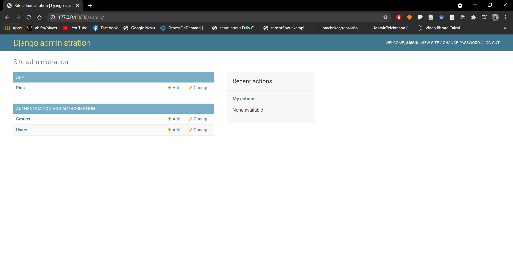
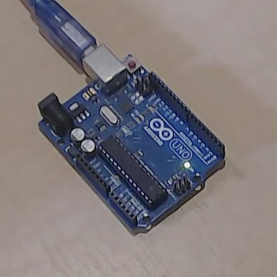

# **How to control an Arduino via the web**

Dr Frazer Noble

---

# **Introduction**

In this presentation, I will describe:
- How to control an Arduino's pin via the web using the Django web framework.

---

# **Overview**

Throughout this tutorial, I will show you how to create an Django application.

It will consist of a:

1. A public website that will allow you to control an Arduino's pins.

---

# **Getting started**

Create a new directory named "django_tutorial" in `C:/Users/%USER%/`.

*Note:* Replace `%USER%` with your username.

---

Connect an Arduino to your computer.

Open the Start menu, type "Device Manager", and press <kbd>Enter</kbd>. This will display Windows' Device Manager.

Expand the "Ports" menu to view the Arduino's COM port.

---

Something similar to the following will be displayed:

 
*Figure:* Windows' Device Manager. Here, an Arduino Uno is connected to the computer. It has enumerated as `COM3`.

---

Open the Arduino IDE.

Open the Start menu, type "Arduino", and press <kbd>Enter</kbd>. This will display the Arduino IDE.

Create a new sketch: Select "File > New" or press <kbd>Ctrl</kbd>+<kbd>N</kbd>.

---

Something similar to the following will be displayed:


*Figure:* Arduino IDE.

---

Type the following C++ program into the file:

```c++
void setup() 
{
  Serial.begin(9600);

  pinMode(13, OUTPUT);
  digitalWrite(13, HIGH);
}
```
---
```c++
void loop() 
{
  if (Serial.available() >= 2)
  {
    char buffer[3] {};

    Serial.readBytes(buffer, 3);

    int pin {atoi(buffer)};

    switch(pin)
    {
      case 13: 
      {
        digitalWrite(13, !digitalRead(led));
        Serial.println(digitalRead(led));
        break;
      }
    }
  }
}
```

---

Save the sketch in `C:/Users/%USER%/django_tutorial`: either:
1) Select "File > Save";
or,
2) Press <kbd>Ctrl</kbd>+<kbd>S</kbd>, and navigate to `C:/Users/%USER%/django_tutorial`.

---

Open Visual Studio Code in `C:/Users/%USER%/django_tutorial`: either: 
1) Open Visual Studio Code and select "File > Open Folder..." and navigate to `C:/Users/%USER%/django_tutorial`; 
or, 
2) Right click in `C:/Users/%USER%/django_tutorial` and select "Open with Code".

Open a new terminal: either: 
1) press <kbd>Ctrl</kbd>+<kbd>~</kbd>; 
or
2) select "View > Terminal".

---

Create a new virtual environment named "venv".

Type the following command into the terminal and then press <kbd>Enter</kbd>:

```console
python -m venv venv
```

This will create the `venv` virtual environment in `django_tutorial`.

*Note:* A prompt indicating Visual Studio Code "noticed a new virtual environment" and will ask "if you want to select it for the workspace folder". Press the "Yes" button.

---

Activate the virtual environment.

Type the following command into the terminal and then press <kbd>Enter</kbd>:

```console
.\venv\Scripts\Activate.ps1
```

This will activate the `venv` virtual environment.

*Note:* To deactivate the `venv` virtual environment, type `deactivate` into the terminal and then press <kbd>Enter</kbd>.

---

Install `Django`.

Type the following command into the terminal and then press <kbd>Enter</kbd>:

```console
python -m pip install Django
```

This will install the latest version of `Django` into the `venv` virtual environment.

---

Install `pyserial`.

Type the following command into the terminal and then press <kbd>Enter</kbd>:

```console
python -m pip install pyserial
```

This will install the latest version of `pyserial` into the `venv` virtual environment.

---

Update `pip`. 

Type the following command into the terminal and then press <kbd>Enter</kbd>:

```console
python -m pip install --upgrade pip
```

This will update `pip` to the latest version.

---

# **Creating a project**

Create a new project named `web_controller`.

Type the following command into the terminal and then press <kbd>Enter</kbd>:

```console
django-admin startproject web_controller
```

This will create a `web_controller` directory. 

---

`web_controller` contains the following directories and files:

```console
web_controller/
    web_controller/
        __init__.py
        asgi.py
        settings.py
        urls.py
        wsgi.py
    manage.py
```

---

- The outer `web_controller/` root directory is a container for your project. 
- `manage.py`: A command-line utility that lets you interact with this Django project in various ways.
- The inner `web_controller/` directory is the actual Python package for your project.
- `web_controller/__init__.py`: An empty file that tells Python that this directory should be considered a Python package.
- `web_controller/settings.py`: Settings/configuration for this Django project.
- `web_controller/urls.py`: The URL declarations for this Django project.
- `web_controller/asgi.py`: An entry-point for ASGI-compatible web servers to serve your project.
- `web_controller/wsgi.py`: An entry-point for WSGI-compatible web servers to serve your project.

---

# **The development server**

Verify the project works.

Type the following command into the terminal and then press <kbd>Enter</kbd>:

```console
cd web_controller
```

This will change the current directory to the outer `web_controller` directory.

Type the following command into the terminal and then press <kbd>Enter</kbd>:

```console
python manage.py runserver
```

This will launch the development server.

---

Something similar to the following will be displayed:

```console
Watching for file changes with StatReloader
Performing system checks...

System check identified no issues (0 silenced).

You have 18 unapplied migration(s). Your project may not work properly until you apply 
    the migrations for app(s): admin, auth, contenttypes, sessions.
Run 'python manage.py migrate' to apply them.
April 07, 2021 - 15:25:44
Django version 3.2, using settings 'web_controller.settings'
Starting development server at http://127.0.0.1:8000/       
Quit the server with CTRL-BREAK.
```

---

Browse to [http://127.0.0.1:8000/](http://127.0.0.1:8000/).

---

Something similar to the following will be displayed:


*Figure:* The "The Install Worked Successfully! Congratulations" website.

---

# **Creating the App app**

Create an app named "app".

Type the following command into the terminal and then press <kbd>Enter</kbd>:

```console
python manage.py startapp app
```

This will create an `app` directory.

---

`app` contains the following directories and files:

```console
app/
    migrations/
        __init__.py
    __init__.py
    admin.py
    apps.py
    models.py
    tests.py
    views.py
```

---

- The `migrations/` directory is where changes to the project's database are stored.
- `migrations/__init__.py`: An empty file that tells Python that this directory should be considered a Python package.
- `__init__.py`: An empty file that tells Python that this directory should be considered a Python package.
- `admin.py`: A file where the app's models are registered.
- `apps.py`: A configuration file for the app.
- `models.py`: A file where the app's models are defined.
- `tests.py`: A file where the app's tests are defined.
- `views.py`: A file where the app's views are defined.

---

# **Writing a view**

Open `app/views.py` and type the following Python code into the file:

```python
from django.http import HttpResponse


def index(request):
    return HttpResponse("Hello world!")
```

<!-- Press <kbd>Ctrl</kbd>+<kbd>S</kbd> to save the file. -->

`index()` will display `Hello World!` in the browser when called.

To call the view, we need to map it to a URL.

---

Create a new file named `urls.py` in `app/`.

Open `app/urls.py` and type the following Python code into the file:

```python
from django.urls import path

from . import views

urlpatterns = [
    path('', views.index, name='index'),
]
```

<!-- Press <kbd>Ctrl</kbd>+<kbd>S</kbd> to save the file. -->

`index()` is mapped to app's `''` URL.

To access the URL, we need to add it to `web_controller`'s list of URLs.

---

Open `web_controller/urls.py` and add the following Python code into the file:

```python
from django.contrib import admin
from django.urls import include, path

urlpatterns = [
    path('app/', include('app.urls')),
    path('admin/', admin.site.urls),
]
```

<!-- Press <kbd>Ctrl</kbd>+<kbd>S</kbd> to save the file. -->

This will map `index()` to `web_controller`'s `app/` URL.

When browsing to `app/`, `Hello World!` will be displayed.

---

To view `index()`'s output, browse to [http://127.0.0.1:8000/app](http://127.0.0.1:8000/app).

---

The following will be displayed:


*Figure:* The `index()` view's output being displayed in the browser.

---

# **Database setup**

Type the following command into the terminal and then press <kbd>Enter</kbd>:

```console
python manage.py migrate
```

This will create any necessary database tables.

---

# **Creating models**

A model is a definition of your data's structure; it contains essential fields and behaviours.

Open `app/models.py` and type the following Python code into the file:

```python
from django.db import models


class PIN(models.Model):
    id = models.AutoField(primary_key=True)
    name = models.CharField(max_length=200, default='13')
    pin_number = models.IntegerField(default=13)
    state = models.BooleanField(default=0)

    def __str__(self):
        return self.name
```

<!-- Press <kbd>Ctrl</kbd>+<kbd>S</kbd> to save the file. -->

---

# **Activating models**

Open `web_controller/settings.py` and type the following Python code into the file:

```python
...
INSTALLED_APPS = [
    'app.apps.AppConfig',
    'django.contrib.admin',
    'django.contrib.auth',
    'django.contrib.contenttypes',
    'django.contrib.sessions',
    'django.contrib.messages',
    'django.contrib.staticfiles',
]
...
```

<!-- Press <kbd>Ctrl</kbd>+<kbd>S</kbd> to save the file. -->

---

Type the following command into the terminal and then press <kbd>Enter</kbd>:

```console
python manage.py makemigrations
```

This will save any changes that have been made to the project's models.

Something similar to the following will be displayed:

```console
Migrations for 'app':
  app/migrations/0001_initial.py
    - Create model PIN
```

The migration will be saved in `app/migrations`.

---

Type the following command into the terminal and then press <kbd>Enter</kbd>:

```console
python manage.py check
```

This will check if there are any issues with the project.

Something similar to the following will be displayed:

```console
System check identified no issues (0 silenced).
```

---

Type the following command into the terminal and then press <kbd>Enter</kbd>:

```console
python manage.py migrate
```

This will apply any changes that have been made to the project's database.

Something similar to the following will be displayed:

```console
Operations to perform:
  Apply all migrations: admin, auth, contenttypes, app, sessions
Running migrations:
  Rendering model states... DONE
  Applying app.0001_initial... OK
```

---

# **The database API**

Type the following command into the terminal and then press <kbd>Enter</kbd>:

```console
python manage.py shell
```

This will invoke the Python shell.

---

Type the following commands into the Python shell:

```console
>>> from app.models import PIN
>>> PIN.objects.all()
<QuerySet []>
>>> pin = PIN(name="13", pin_number=13, state=False)
>>> pin.save()
>>> pin.id
1
>>> pin.name
'13'
>>> pin.pin_number
13
>>> pin.state
False
>>> pin.state = True
>>> PIN.objects.all()
<QuerySet [<PIN: 13>]>
>>>
```

Press <kbd>Ctrl</kbd>+<kbd>Z</kbd> and then <kbd>Enter</kbd> to terminate the shell.

---

# **The Django admin**

Type the following command into the terminal and then press <kbd>Enter</kbd>:

```console
python manage.py createsuperuser
```

Enter a username, email, and password.

*Note:* If your password is too similar to the username, too short (< 8 characters), or too common, you will receive a warning message. However, you can bypass password validation if you want.

---

Open `app/admin.py` and type the following Python code into the file:

```python
from django.contrib import admin

from .models import PIN


admin.site.register(PIN)
```

<!-- Press <kbd>Ctrl</kbd>+<kbd>S</kbd> to save the file. -->

This will register the `PIN` model with the Django admin website.

---

To view the admin website, browse to [http://127.0.0.1:8000/admin](http://127.0.0.1:8000/admin).

---

The following will be displayed:


*Figure:* Django admin website.

Log in with the admin user's credentials.

---

The following will be displayed:


*Figure:* Django admin website.

Left click on the "Pins" link.

---

The following will be displayed:


*Figure:* Django admin website.

Left click on the "13" link.

---

The following will be displayed:


*Figure:* Django admin website.

---

# **Writing more views**

Open `app/views.py` and type the following Python code into the file:

```python
from django.http import HttpResponse


def index(request):
    return HttpResponse("Hello world!")


def toggle(request, pin_number):
    return HttpResponse("pin_number: {}".format(pin_number))
```

<!-- Press <kbd>Ctrl</kbd>+<kbd>S</kbd> to save the file. -->

`toggle()` accepts an additional argument, `pin_number` and will display its value in the browser when called.

To call the view, we need to map it to a URL.

---

Open `app/urls.py` and type the following Python code into the file:

```python
from django.urls import path

from . import views

urlpatterns = [
    path('', views.index, name='index'),
    path('toggle/<int:pin_number>/', views.toggle, name='toggle')
]
```

<!-- Press <kbd>Ctrl</kbd>+<kbd>S</kbd> to save the file. -->

`toggle()` is mapped to app's `'toggle/<int:pin_number>/'` URL. 

---

To view `toggle()`'s output, browse to [http://127.0.0.1:8000/app/toggle/13/](http://127.0.0.1:8000/app/toggle/13/).

---

The following will be displayed:


*Figure:* The `toggle()` view's output being displayed in the browser.

---

# **Write views to do something**

Open `app/views.py` and type the following Python code into the file:

```python
from django.htpp import HttpResponse

from .models import PIN

def index(request):
    pin_list = PIN.objects.order_by('name')[:]

    output = ','.join([p.name for p in pin_list])
    
    return HttpResponse(output)
...
```

<!-- Press <kbd>Ctrl</kbd>+<kbd>S</kbd> to save the file. -->

`index()` get's a list of all the `PIN` instances and displays it in the browser.

The problem with this is that the page's design is hard-coded in the view.

---

Create a a new directory named "templates" in `app`.

Create a new directory named "app" in `app/templates/`.

Create a new file named "index.html" in `app/templates/app`.

---

Open `app/index.html` and type the following HTML code into file:

```html
<!doctype html>
<html lang="en">
  <head>
    <meta charset="utf-8">
    <title>Pin Toggle</title>
  </head>
  <body>
    
        <table>
        
            <tr><td>{{pin.name}}[{{pin.number}}] is {{pin.state}}</td></tr>
            <button value="{{pin.pin_number}}">Click me!</button>
        
        </table>
    
        <p>No pins are available.</p>
    
  </body>
</html>
```

<!-- Press <kbd>Ctrl</kbd>+<kbd>S</kbd> to save the file. -->

---

Open `app/views.py` and type the following Python code into the file:

```python
from django.http import HttpResponse
from django.template import loader

from .models import PIN

def index(request):
    pin_list = PIN.objects.order_by('name')[:]
    
    template = loader.get_template('app/index.html')
    context = { 'pin_list': pin_list }    

    return HttpResponse(template.render(context, request))
...
```

<!-- Press <kbd>Ctrl</kbd>+<kbd>S</kbd> to save the file. -->

`index()` get's a list of all the `PIN` instances and displays it in the browser.

This time, a template is used to decouple the page's design and the view.

---

# **A shortcut: `render()`**

Open `app/views.py` and type the following Python code into the file:

```python
from django.shortcuts import render

from .models import PIN

def index(request):
    pin_list = PIN.objects.order_by('name')[:]

    context = {'pin_list': pin_list}

    return render(request, 'app/index.html', context)
...
```

<!-- Press <kbd>Ctrl</kbd>+<kbd>S</kbd> to save the file. -->

`render()` is a shortcut used to display templates.

---

To view `index()`'s output, browse to [http://127.0.0.1:8000/app/](http://127.0.0.1:8000/app/).

---

The following will be displayed:


*Figure:* The `index()` view's output being displayed in the browser.

---

# **Using static files**

Create a a new directory named "static" in `app`.

Create a new directory named "app" in `app/static/`.

Create new files named "index.css" and "index.js" in `app/static/app`.

---

Browse to [https://jquery.com/](https://jquery.com/) and download jQuery (3.6 as of 04/21). 

Download the "uncompressed, development JQuery" file.

Save the downloaded file in `static/app`.

---

Open `web_controller/settings.py` and type the following Python code into the file:

```python
...
STATICFILES_DIRS = [
    BASE_DIR / "static/",
]
...
```

<!-- Press <kbd>Ctrl</kbd>+<kbd>S</kbd> to save the file. -->

<!-- ---

Open `app/index.css` and type the following CSS code into the file:

```css

``` -->

---

Open `app/index.js` and type the following JavaScript code into the file:

```javascript
function getCookie(name) {
    let cookieValue = null;
    if (document.cookie && document.cookie !== '') {
        const cookies = document.cookie.split(';');
        for (let i = 0; i < cookies.length; i++) {
            const cookie = cookies[i].trim();
            // Does this cookie string begin with the name we want?
            if (cookie.substring(0, name.length + 1) === (name + '=')) {
                cookieValue = decodeURIComponent(cookie.substring(name.length + 1));
                break;
            }
        }
    }
    return cookieValue;
}

const csrftoken = getCookie('csrftoken');
```
---
```javascript
$('button').click(function () {
    console.log(this.id + ' ' + 'clicked!');

    $.ajax({
        type: 'POST',
        url: '/app/toggle/' + this.value + '/',
        data: {
            'pin_number': this.value,
        },
        headers: {
            'X-CSRFToken': csrftoken
        },
        success: function() {
            console.log('Success');
        },
        dataType: 'text'
    })
});
```

<!-- Press <kbd>Ctrl</kbd>+<kbd>S</kbd> to save the file. -->

---

Open `app/index.html` and type the following HTML code into the file:

```html
...
<body>
    ...
    

    <link rel="stylesheet" type="text/css" href="">
    <script type="text/javascript" src=""></script>
    <script type="text/javascript" src=""></script>
</body>
...
```

<!-- Press <kbd>Ctrl</kbd>+<kbd>S</kbd> to save the file. -->

---

# **Writing to a serial port**

Open `app/views.py` and type the following Python code into the file:

```python
import serial

from django.shortcuts import render

from .models import PIN


ser = serial.Serial('COM3')


def toggle_pin(pin=13):

    ser.write('{}\n'.format(pin).encode('utf-8'))

    return 0
```
---
```python
def index(request):
    pin_list = PIN.objects.order_by('name')[:]
    context = {'pin_list': pin_list}

    return render(request, 'app/index.html', context)


def toggle(request, pin_number):
    pin = PIN.objects.get(pin_number=pin_number)
    pin.state = False if pin.state is True else True
    pin.save()

    toggle_pin(pin.pin_number)
        
    pin_list = PIN.objects.order_by('name')[:]
    context = {'pin_list': pin_list}

    return render(request, 'app/index.html', context)
```

<!-- Press <kbd>Ctrl</kbd>+<kbd>S</kbd> to save the file. -->

---

# **Testing**

To test the setup, browse to [http://127.0.0.1:8000/app/](http://127.0.0.1:8000/app/).

---

Something similar to the following will be displayed:

  
*Figure:* (Left) The "Pin Toggle" website; and (Right) the Arduino plugged into the computer. Here, we can see that the website indicates the Arduino's Pin 13 is HIGH (True); the LED connected to Pin 13 is ON.

Left click on the "Click Me!" button.

---

Something similar to the following will be displayed:

  
*Figure:* (Left) The "Pin Toggle" website; and (Right) the Arduino plugged into the computer. Here, we can see that the website indicates the Arduino's Pin 13 is LOW (False); the LED connected to Pin 13 is OFF.

The LED has been turned off via a website!

---

# **Conclusion**

In this presentation, I have described:
- How to control an Arduino's pin via the web using the Django web framework.

---

# **References**

1. [https://www.djangoproject.com/](https://www.djangoproject.com/)
1. [https://www.djangoproject.com/start/](https://www.djangoproject.com/start/)
1. [https://docs.djangoproject.com/en/3.2/intro/tutorial01/](https://docs.djangoproject.com/en/3.2/intro/tutorial01/)
1. [https://jquery.com/](https://jquery.com/)
1. [https://getbootstrap.com/](https://getbootstrap.com/)
1. [https://docs.djangoproject.com/en/3.1/ref/csrf/](https://docs.djangoproject.com/en/3.1/ref/csrf/)
1. [https://www.w3schools.com/html/](https://www.w3schools.com/html/)
1. [https://www.w3schools.com/js/default.asp](https://www.w3schools.com/js/default.asp)
1. [https://www.digitalocean.com/community/tutorials/how-to-set-up-django-with-postgres-nginx-and-gunicorn-on-ubuntu-20-04](https://www.digitalocean.com/community/tutorials/how-to-set-up-django-with-postgres-nginx-and-gunicorn-on-ubuntu-20-04)