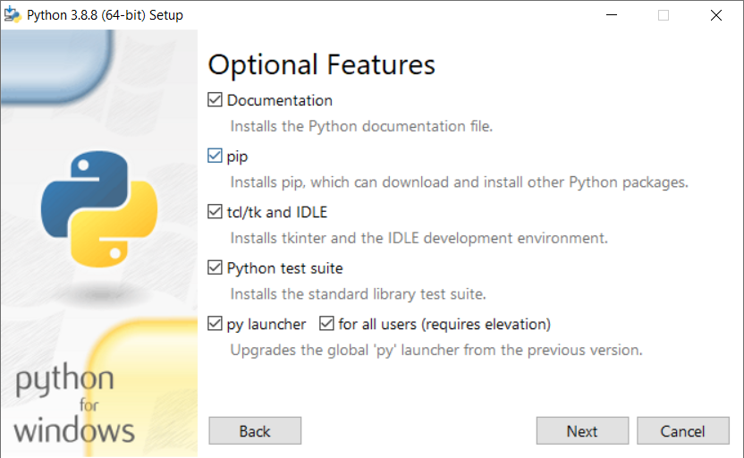

# **How to Install Python**

Dr Frazer Noble

---

# **Introduction**

In this presentation, I will describe:
- How to install Python.

---

# **Install Python**

To get the latest version of Python, browse to [https://python.org/](https://python.org/).

1. Left click on the "Downloads" button.
1. Left click on the "All Releases" button.
1. Scroll down and left click on the Python version you want to install, e.g. "3.8.8".
1. Scroll down and left click on the installer you want to use, e.g. "Windows installer (64-bit)".

Browse to where the installer was downloaded it and run the program. This will start the installation process.

---

At first, the Install Python window will be displayed. 

Ensure the following check boxes are ticked.

*Figure:* The installer's Install Python window. 

Left click on the "Customize installation" button.

---

Next, the Optional Features window will be displayed.

Ensure the following check boxes are ticked.

*Figure:* The installer's Optional Features window. 

Left click on the "Next" button.

---

Next, the Advanced Options window will be displayed.

Ensure the following check boxes are ticked. Change the install location to: `C:\Python38`.

*Figure:* The installer's Advanced Options window. 

Left click on the "Next" button.

---

Next, a prompt to enable changes to the system will be displayed.

*Figure:* Prompt to enable changes to the system. 

Left click on the "Yes" button.

---

Next, the Setup Progress window will be displayed.

*Figure:* The installer's Setup Progress window. 

Wait for Python to be installed. This will take a few minutes.

---

Next, the Setup was successful window will be displayed.

*Figure:* The installer's Setup was sucessful window. 

Left click on the "Close" button.

---

# **Verify Installation**

Open the Start menu. 

Type "Python 3.8 (64-bit)" and press <kbd>Enter</kbd>.

*Figure:* Python terminal window.

This will open a Python terminal. 

Press <kbd>Ctrl</kbd>+<kbd>Z</kbd> to quit.

---

# **Conclusion**

In this presentation, I have described:
- How to install Python.
