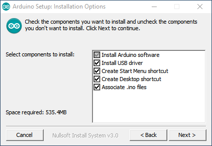

# **How to install Arduino**

Dr Frazer Noble

---

# **Introduction**

In this presentation, I will describe:
- How to install Arduino's IDE.

---

# **Get Arduino**

Browse to [https://www.arduino.cc/](https://www.arduino.cc/).

Something similar to the following will be displayed:

*Figure:* https://www.arduino.cc/.

Left click on the "Software" button. 

---

Something similar to the following will be displayed:

*Figure:* https://www.arduino.cc/en/software.

Left click on the "Windows" link (under "Download Options").

---

Something similar to the following will be displayed:

*Figure:* https://www.arduino.cc/en/donate/.

Left click on the "Just Download" button.

---

Browse to where Arduino's setup program was downloaded.

Either:
1) Double click on program's icon;
or,
2) Left click on the program's icon and press <kbd>Enter</kbd>. 

This will start the installation process.

---

# **Arduino Setup: License Agreement**

Something similar to the following will be displayed:

*Figure:* Arduino Setup: License Agreement window.

Left click on the "I Agree" button.

---

# **Arduino Setup: Installation Options**

Something similar to the following will be displayed:

*Figure:* Arduino Setup: Installation Options window.

Left click on the "Next >" button.

---

# **Arduino Setup: Installation Folder**

Something similar to the following will be displayed:

*Figure:* Arduino Setup: Installation Folder window.

Left click on the "Install" button.

---

# **Installing**

Something similar to the following will be displayed:

*Figure:* Installing window.

Wait for the installation process to complete.

---

# **Arduino Setup: Completed window**

Something similar to the following will be displayed:

*Figure:* Arduino Setup: Completed window.

Left click on the "Close" button.

---

# **Arduino**

Open the Start menu, type "Arduino", and select the app. 

Something similar to the following will be displayed:

*Figure:* Arduino's IDE.

Congratulations: you have successfully installed Arduino's IDE!

---

# **Conclusion**

In this presentation, I have described:
- How to install Arduino's IDE.