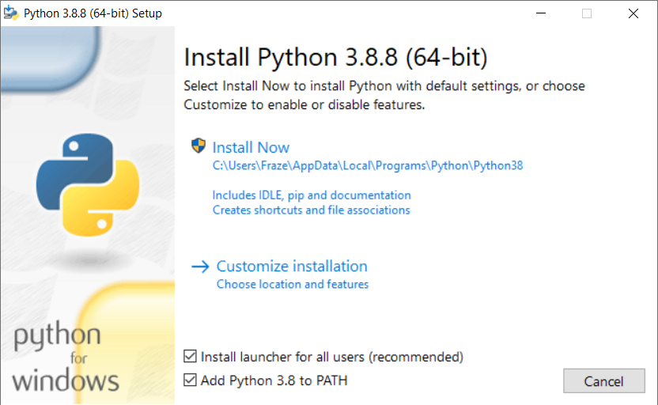
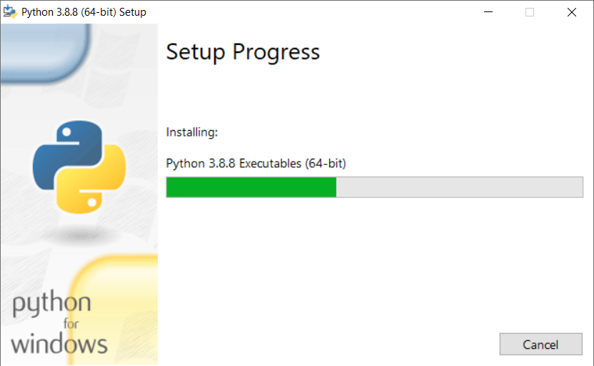

# **How to Install Python**

Dr Frazer Noble

---

# **Introduction**

In this presentation, I will describe:
- How to install Python.

---

# **Install Python**

Browse to [https://python.org/](https://python.org/).

Something similar to the following will be displayed:

*Figure:* https://python.org/

---

Left click on the "Downloads" button.

Left click on the "All Releases" button.

Scroll down and left click on the Python version you want to install, e.g. "3.8.8".

Scroll down and left click on the installer you want to use, e.g. "Windows installer (64-bit)".

Browse to where Python's setup program was downloaded.

Either:
1. Double click on the program's icon;
or, 
2. Left click on the program's icon and press <kbd>Enter</kbd>.

This will start the installation process.

---

# **Install Python**

Something similar to the following will be displayed:

*Figure:* Install Python window. 

Select the check boxes.

Left click on the "Customize installation" button.

---

# **Optional Features**

Something similar to the following will be displayed:

*Figure:* Optional Features window. 

Select the check boxes.

Left click on the "Next" button.

---

# **Advanced Features**

Something similar to the following will be displayed:

*Figure:* Advanced Options window. 

Select the check boxes. Change the install location to: `C:\Python38`.

Left click on the "Install" button.

---

# **Setup Progress**

Something similar to the following will be displayed:

*Figure:* Setup Progress window. 

Wait for the installation process to complete.

---

# **Setup was successfull**

Something similar to the following will be displayed:

*Figure:* Setup was sucessful window. 

Left click on the "Close" button.

---

# **Python**

Open the Start menu, type "Python 3.8 (64-bit)", and then press <kbd>Enter</kbd>.

*Figure:* Python terminal window.

Congratulations: you have successfully installed Python!

---

# **Conclusion**

In this presentation, I have described:
- How to install Python.
