# **How to install Qt Creator**

Dr Frazer Noble

---

# **Introduction**

In this presentation, I will describe:
- How to install Qt's Qt Creator.

---

# **Get Qt Creator**

Browse to [https://www.qt.io/](https://www.qt.io/).

Something similar to the following will be displayed:

*Figure:* https://www.qt.io/.

Left click on the "Download.Try." button. 

---

Something similar to the following will be displayed:

*Figure:* https://www.qt.io/download.

Scroll down.

Left click on the "Go open source" button.

---

Something similar to the following will be displayed:

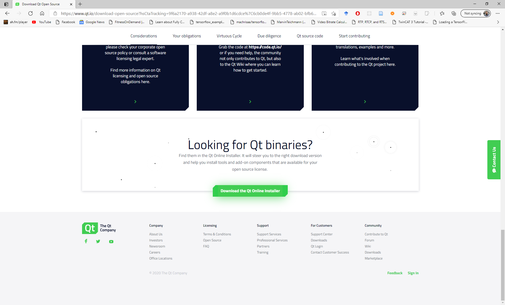
*Figure:* https://www.qt.io/download-open-source.

Scroll down.

Left click on the "Download the Qt Online Installer" button.

---

Something similar to the following will be displayed:

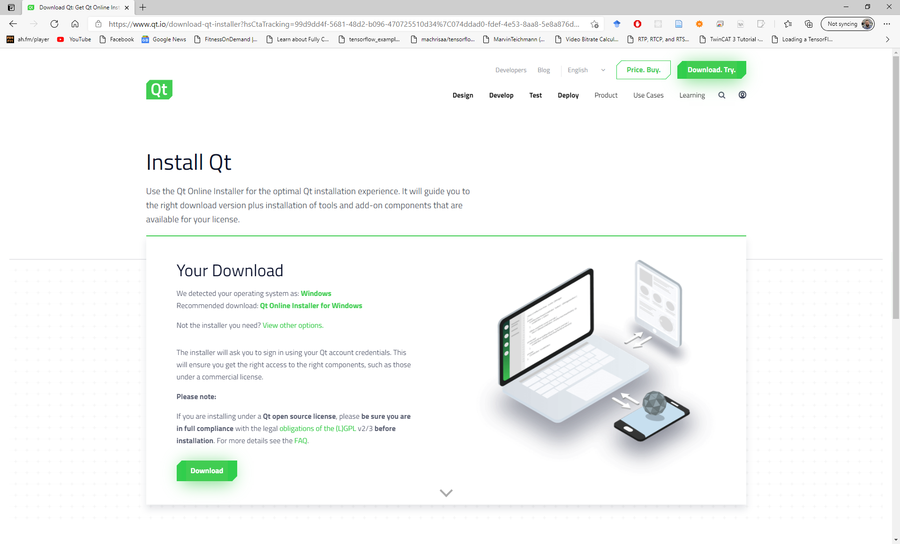
*Figure:* https://www.qt.io/download-qt-installer.

Left click on the "Download" button.

---

Browse to where Qt's setup program was downloaded.

Either:
1) Double click on program's icon;
or,
2) Left click on the program's icon and press <kbd>Enter</kbd>. 

This will start the installation process.

---

# **Welcome to the Qt online installer**

Something similar to the following will be displayed:

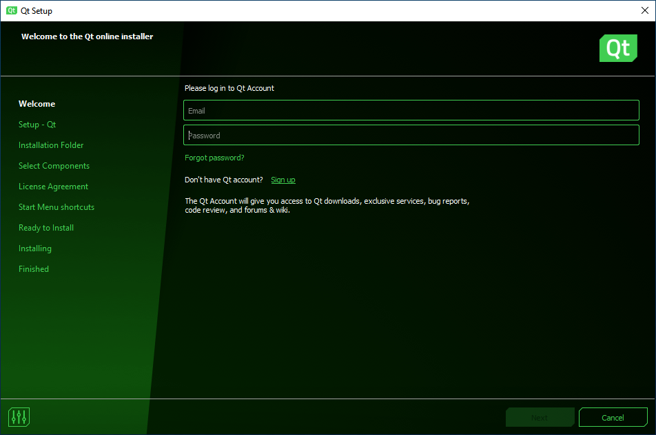
*Figure:* Welcome to the Qt online installer window.

Either log in to your Qt Account or create a new account.

Left click on the "Next" button.

---

# **Qt Open Source Usage Obligations**

Something similar to the following will be displayed:

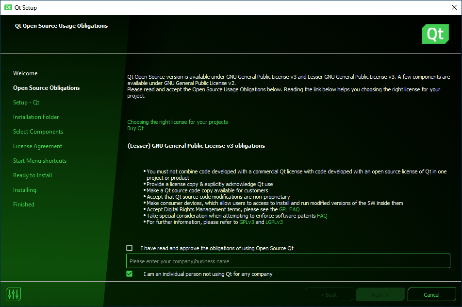
*Figure:* Qt Open Source Usage Obligations window.

Select the "I have read and approve .." check box.

Left click on the "Next >" button.

---

# **Welcome to open source Qt setup**

Something similar to the following will be displayed:

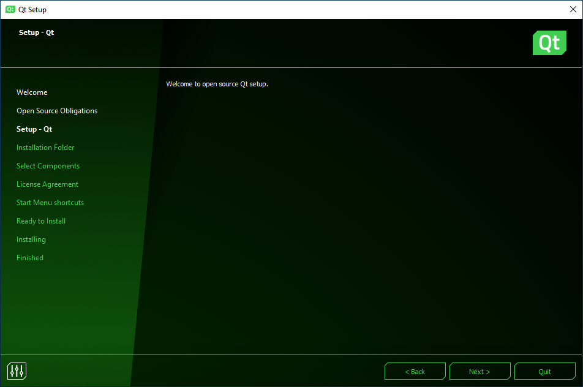
*Figure:* Welcome to open source Qt setup window.

Left click on the "Next >" button.

---

# **Contribute to Qt Development**

Something similar to the following will be displayed:

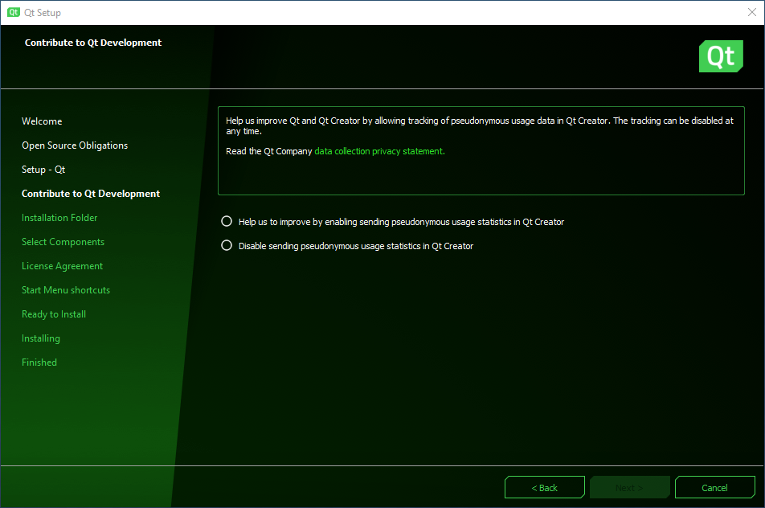
*Figure:* Contribute to Qt Development window.

Select the "Help us to improve ..." radio button.

Left click on the "Next" button.

---

# **Installation Folder**

Something similar to the following will be displayed:

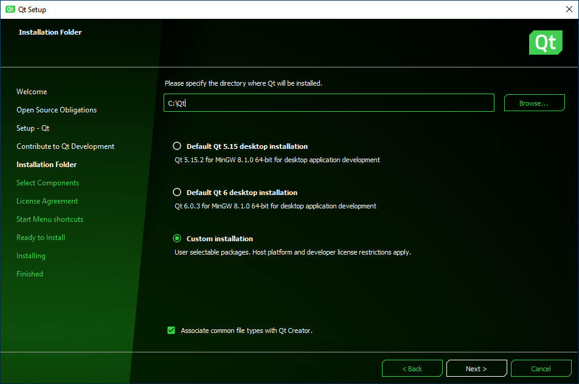
*Figure:* Installation Folder window.

Left click on the "Next" button.

---

# **Select Components**

Something similar to the following will be displayed:

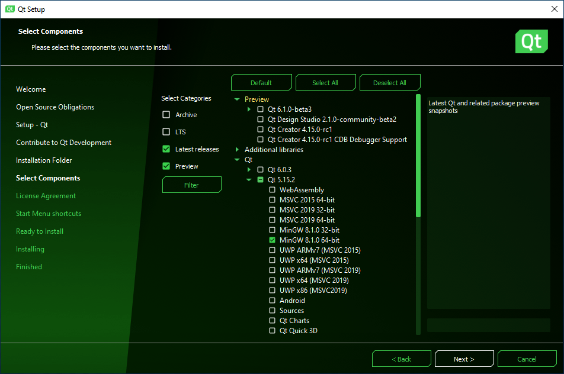
*Figure:* Select Components window.

Expand the "Qt 5.15.2" menu. 

Select the "MinGW 8.1.0 64-bit" check box.

Left click on the "Next" button.

---

# **Licence Agreement**

Something similar to the following will be displayed:

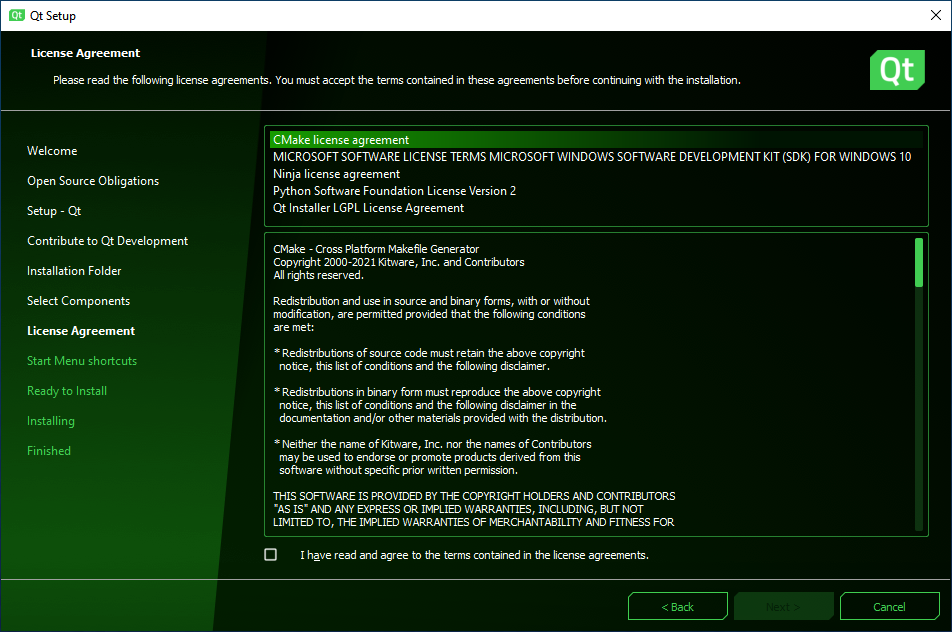
*Figure:* Licence Agreement window.

Select the "I have read ..." check box.

Left click on the "Next" button.

---

# **Start Menu shortcuts**

Something similar to the following will be displayed:

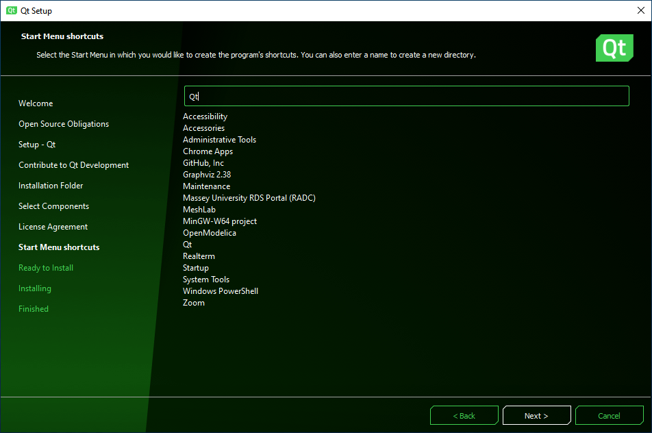
*Figure:* Start Menu shortcuts window.

Left click on the "Next" button.

---

# **Ready to install**

Something similar to the following will be displayed:

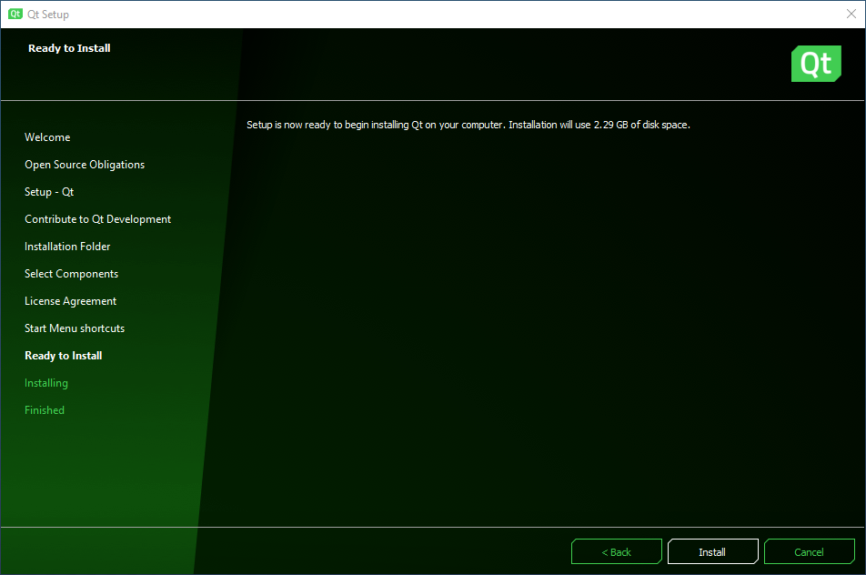
*Figure:* Ready to install window.

Left click on the "Install" button.

---

# **Installing Qt**

Something similar to the following will be displayed:

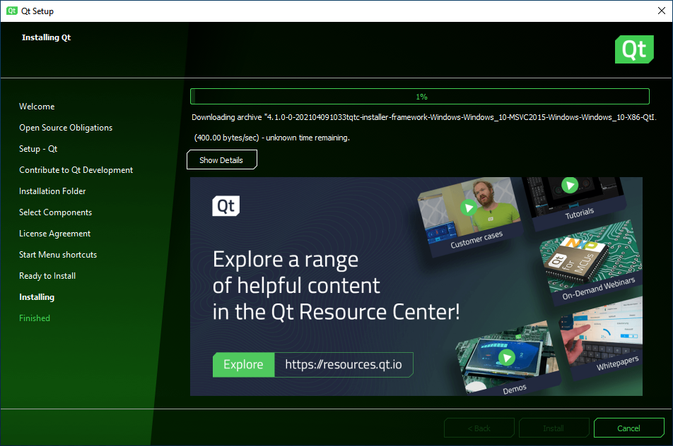
*Figure:* Installing Qt window.

Wait for the installation process to complete.

---

# **Completing the Qt Wizard**

Something similar to the following will be displayed:

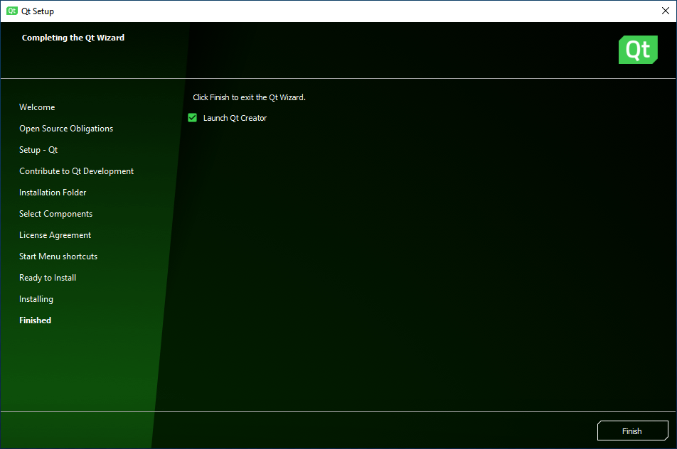
*Figure:* Installing Qt window.

Left click on the "Finish" button.

---

# **Qt Creator**

Something similar to the following will be displayed:

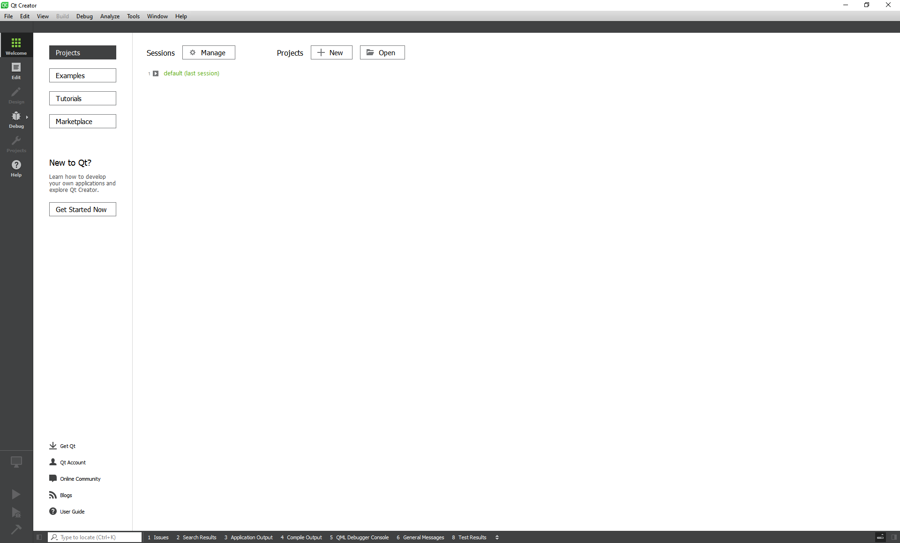
*Figure:* Qt's Qt Creator.

Congratulations: you have successfully installed Qt's Qt Creator!

---

# **Conclusion**

In this presentation, I have described:
- How to install Qt's Qt Creator.