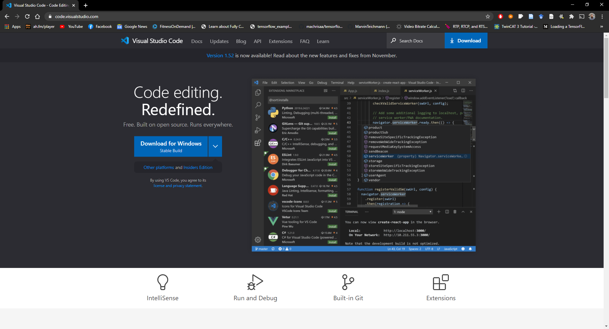
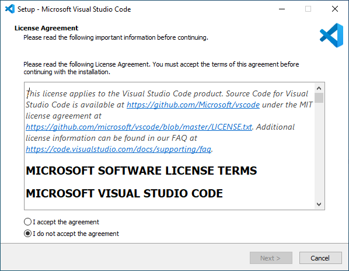
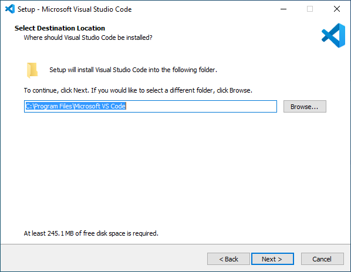
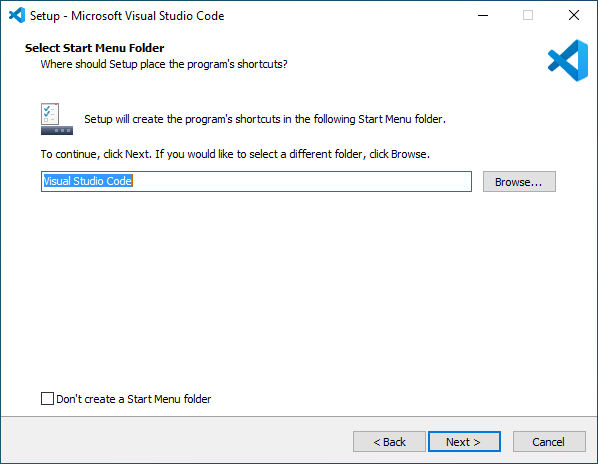
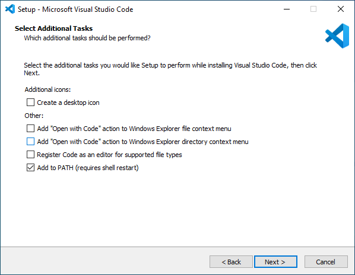
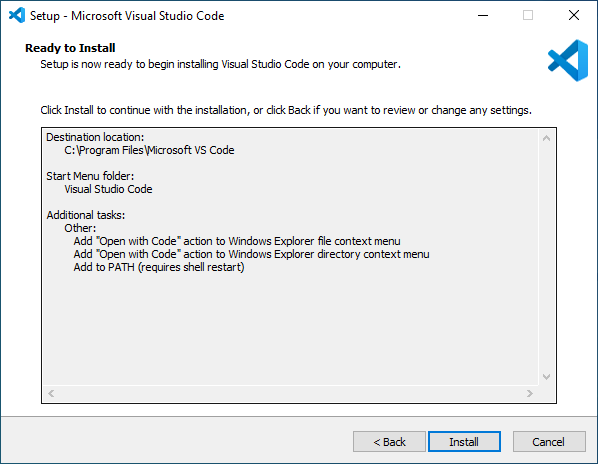
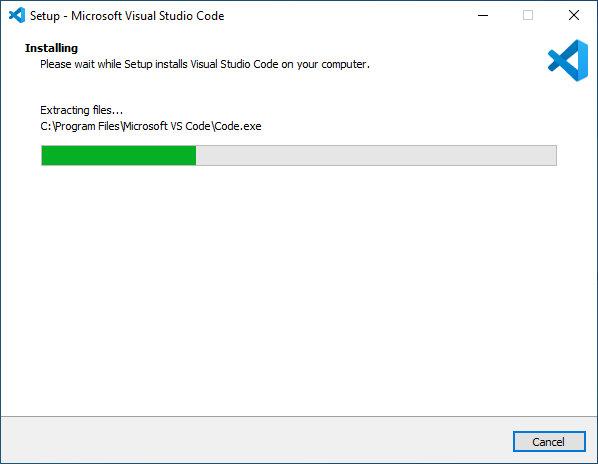
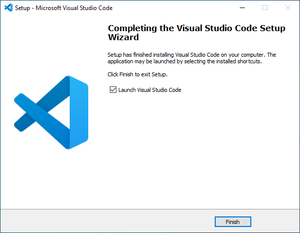
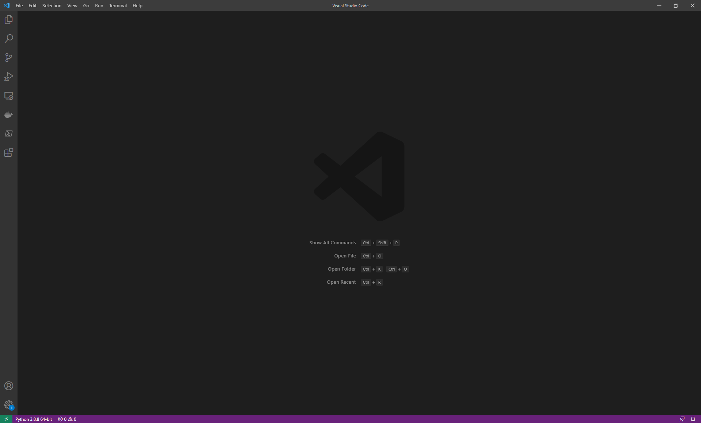

# **How to install Visual Studio Code**

Dr Frazer Noble

---

# **Introduction**

In this presentation, I will describe:
- How to install Microsoft's Visual Studio Code.

---

# **Get Visual Studio Code**

Browse to [https://code.visualstudio.com/](https://code.visualstudio.com/).

*Figure:* https://code.visualstudio.com/.

---

Left click on the "Download for Windows" button. 

This will download Visual Studio Code's setup program.

Browse to where Visual Studio Code's setup program was downloaded.

Either:
1) Double click on program's icon;
or,
2) Left click on the program's icon and press <kbd>Enter</kbd>. 

This will start the installation process.

---

# **Licence Agreement**

Something similar to the following will be displayed:

*Figure:* Licence Agreement window.

Select the "I accept the agreement" radio button.

Left click on the "Next >" button.

---

# **Select Destination Location**

Something similar to the following will be displayed:

*Figure:* Select Destination Location window.

Left click on the "Next >" button.

---

# **Select Start Menu Folder**

Something similar to the following will be displayed:

*Figure:* Select Start Menu Folder window.

Left click on the "Next >" button.

---

# **Select Additional Tasks**

Something similar to the following will be displayed:

*Figure:* Select Additional Tasks window.

Select the "Open with Code ..." check boxes.

Left click on the "Next >" button.

---

# **Ready to Install**

Something similar to the following will be displayed:

*Figure:* Ready to Install window.

Left click on the "Install" button.

---

# **Installing**

Something similar to the following will be displayed:

*Figure:* Installing window.

Wait for the installation process to complete.

---

# **Completing the Visual Studio Code Setup Wizard**

Something similar to the following will be displayed:

*Figure:* Completing the Visual Studio Code Setup Wizard.

Select the "Launch Visual Studio Code" check box.

Left click on the Finish button.

---

# **Visual Studio Code**

Something similar to the following will be displayed:

*Figure:* Visual Studio Code.

Congratulations: you have successfully installed Visual Studio Code!

---

# **Conclusion**

In this presentation, I have described:
- How to install Microsoft's Visual Studio Code.
