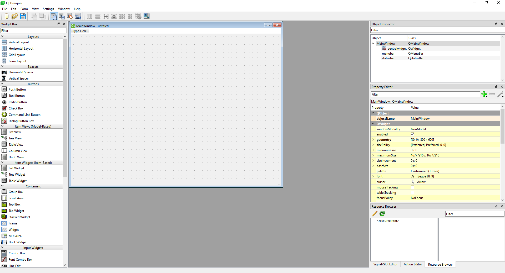

# **How to get started with Qt for Python**

Dr Frazer Noble

---

# **Introduction**

In this presentation, I will describe:
- How to get started with Qt for Python.

---

# **Getting started**

Create a new directory named "pyside6" in `C:/Users/%USER%/`.

*Note:* Replace `%USER%` with your username.

---

Open Visual Studio Code in `C:/Users/%USER%/pyside6`: either: 
1) Open Visual Studio Code and select "File > Open Folder..." and navigate to `C:/Users/%USER%/pyside6`; 
or, 
2) Right click in `C:/Users/%USER%/pyside6` and select "Open with Code".

Open a new terminal: either: 
1) press <kbd>Ctrl</kbd>+<kbd>~</kbd>; 
or
2) select "View > Terminal".

---

Create a new virtual environment named "venv".

Type the following command into the terminal and then press <kbd>Enter</kbd>:

```console
python -m venv venv
```

This will create the `venv` virtual environment in `pyside6`.

*Note:* A prompt indicating Visual Studio Code "noticed a new virtual environment" and will ask "if you want to select it for the workspace folder". Press the "Yes" button.

---

Activate the virtual environment.

Type the following command into the terminal and then press <kbd>Enter</kbd>:

```console
.\venv\Scripts\Activate.ps1
```

This will activate the `venv` virtual environment.

*Note:* To deactivate the `venv` virtual environment, type `deactivate` into the terminal and then press <kbd>Enter</kbd>.

---

Install `pyside6`.

Type the following command into the terminal and then press <kbd>Enter</kbd>:

```console
python -m pip install pyside6
```

This will install the latest version of `pyside6` into the `venv` virtual environment.

---

Update `pip`. 

Type the following command into the terminal and then press <kbd>Enter</kbd>:

```console
python -m pip install --upgrade pip
```

This will update `pip` to the latest version.

---

# **`hello_world.py`**

Create a new file named "hello_world.py" in `C:/Users/%USER%/pyside6`. 

Open `hello_world.py` and type the following Python code into the file:

```python
import sys

from PySide6 import QtCore, QtGui, QtWidgets
```

---

```python
if __name__ == "__main__":

    app = QtWidgets.QApplication([])

    label = QtWidgets.QLabel('Hello World!')
    label.show()

    sys.exit(app.exec_())
```

---

Type the following command into the terminal and then press <kbd>Enter</kbd>:

```console
python hello_world.py
```

This will run `hello_world.py`.

---

Something similar to the following will be displayed:


*Figure:* `hello_world.py`'s GUI.

---

# **`simple_button.py`**

Create a new file named "simple_button.py"  in `C:/Users/%USER%/pyside6`.

Open `simple_button.py` and type the following Python code into the file:

```python
import sys

from PySide6 import QtCore, QtGui, QtWidgets


@QtCore.Slot()
def greet():
    print("Hello World!")
```

---

```python
if __name__ == "__main__":

    app = QtWidgets.QApplication([])

    button = QtWidgets.QPushButton("Click Me!")
    button.clicked.connect(greet)

    button.show()

    sys.exit(app.exec_())

```

---

Type the following command into the terminal and then press <kbd>Enter</kbd>:

```console
python simple_button.py
```

This will run `simple_button.py`.

---

Something similar to the following will be displayed:


*Figure:* `simple_button.py`'s GUI.

Left click on the "Click Me!" button.

"Hello World!" will be displayed in the terminal.

---

# **`simple_dialog.py`**

Create a new file named "simple_dialog.py" in `C:/Users/%USER%/pyside6`.

Open `simple_dialog.py` and type the following Python code into the file:

```python
import sys

from PySide6 import QtCore, QtGui, QtWidgets
```
---
```python
class Form(QtWidgets.QDialog):

    def __init__(self, parent=None):

        super(Form, self).__init__(parent)
        self.setWindowTitle("My Form")

        self.label = QtWidgets.QLabel('Username:')
        self.username = QtWidgets.QLineEdit("")
        self.button = QtWidgets.QPushButton("Click Me!")

        self.layout = QtWidgets.QVBoxLayout(self)
        self.layout.addWidget(self.label)
        self.layout.addWidget(self.username)
        self.layout.addWidget(self.button)

        self.button.clicked.connect(self.greet)

    @QtCore.Slot()
    def greet(self):
        print("Hello {}!".format(self.username.text()))
```
---
```python
if __name__ == "__main__":

    app = QtWidgets.QApplication([])

    form = Form()
    form.show()

    sys.exit(app.exec_())

```

---

Type the following command into the terminal and then press <kbd>Enter</kbd>:

```console
python simple_dialog.py
```

This will run `simple_dialog.py`.

---

Something similar to the following will be displayed:


*Figure:* `simple_dialog.py`'s GUI.

Type "Bob" into the LineEdit's input.

Left click on the "Click Me!" button.

"Hello Bob!" will be displayed in the terminal.

---

# **Qt Designer**

Type the following command into the terminal and then press <kbd>Enter</kbd>:

```console
pyside6-designer
```

This will start Qt Designer.

---

Something similar to the following will be displayed:


*Figure:* Qt Designer.

Left click on "Main Window" in the "templates\forms" menu.

Left click on the "Create" button.

---

Something similar to the following will be displayed:


*Figure:* Qt Designer.

---

# **`mainwindow.ui`**

Save the project as "mainwindow.ui" in `C:/Users/%USER%/pyside6`. Either: 
1) Press the "Save" button;
or,
2) Select "File > Save".

---

Resize `mainwindow.ui`'s form to 320 x 240 pixels.


*Figure:* `mainwindow.ui`.

---

Drag 1 Label, 1 LineEdit, 1 PushButton, 1 Horizontal Spacer, and 1 VerticalSpacer widget onto `mainwindow.ui` as illustrated:


*Figure:* `mainwindow.ui`.

---

Layout the widgets as illustrated:


*Figure:* `mainwindow.ui`.

---

Change the Label and PushButton widgets' text as illustrated:


*Figure:* `mainwindow.ui`.

Change the Label widget's name to "labelUsername".

Change the LineEdit widget's name to "lineEditUsername".

Set the PushButton widget's minimum width to 75. Change the object's name to "pushButtonGreet".

---

# **`display_ui.py`**

Type the following command into the terminal and then press <kbd>Enter</kbd>:

```console
pyside6-uic mainwindow.ui -o ui_mainwindow.py
```

This will use `mainwindow.ui` to generate a class named `Ui_MainWindow` and save it into a file named `ui_mainwindow.py`.

---

Create a new file named "display_ui.py" in `C:/Users/%USER%/pyside6`.

Open `display_ui.py` and type the following Python code into the file:

```python
import sys

from PySide6 import QtCore, QtGui, QtWidgets

from ui_mainwindow import Ui_MainWindow


class MainWindow(QtWidgets.QMainWindow):
    def __init__(self):
        super(MainWindow, self).__init__()
        self.ui = Ui_MainWindow()
        self.ui.setupUi(self)
```

---

```python
if __name__ == "__main__":

    app = QtWidgets.QApplication([])

    window = MainWindow()
    window.show()

    sys.exit(app.exec_())
```

---

Type the following command into the terminal and then press <kbd>Enter</kbd>:

```console
python display_ui.py
```

This will run `display_ui.py`.

---

Something similar to the following will be displayed:


*Figure:* `display_ui.py`'s GUI.

---

Add the following Python code to `display_ui.py`'s `MainWindow` class:

```python
@QtCore.Slot()
def greet(self):
    print("Hello {}!".format(self.ui.lineEditUsername.text()))
    return
```

This will define the slot `greet()`, which will display a message in the terminal when a signal connected to it is emitted.

---

Add the following Pythyon code to `MainWindow`'s `__init__()` member function:

```Python
self.ui.pushButtonGreet.clicked.connect(self.greet)
```

This will connect the `pushButtonGreet` widget's clicked `signal` to the `greet()` slot.

---

Type the following command into the terminal and then press <kbd>Enter</kbd>:

```console
python display_ui.py
```

This will run `display_ui.py`.

---

Something similar to the following will be displayed:


*Figure:* `display_ui.py`'s GUI.

Type "Bob" into the LineEdit's input.

Left click on the "Click Me!" button.

"Hello Bob!" will be displayed in the terminal.

---

# **dynamic_display_ui.py**

Create a new file named "dynamic_display_ui.py" in `C:/Users/%USER%/pyside6`.

Open `dynamic_display_ui.py` and type the following Python code into the file:

```python
import sys
import os

from PySide6 import QtCore, QtGui, QtWidgets
from PySide6.QtUiTools import QUiLoader
```

---

```python
class MainWindow(QtWidgets.QMainWindow):
    def __init__(self):
        super(MainWindow, self).__init__()
        self.ui = self.load_ui()
        self.ui.show()
        
    def load_ui(self):
        loader = QUiLoader()
        path = os.path.join(os.path.dirname(__file__), "mainwindow.ui")
        ui_file = QtCore.QFile(path)
        ui_file.open(QtCore.QFile.ReadOnly)
        ui = loader.load(ui_file, self)
        ui_file.close()
        return ui
```

---

```python
if __name__ == "__main__":

    app = QtWidgets.QApplication([])

    window = MainWindow()

    sys.exit(app.exec_())
```

---

Type the following command into the terminal and then press <kbd>Enter</kbd>:

```console
python dynamic_display_ui.py
```

This will run `dynamic_display_ui.py`.

---

Something similar to the following will be displayed:


*Figure:* `dynamic_display_ui.py`'s GUI.

---


Add the following Python code to `dynamic_display_ui.py`'s `MainWindow` class:

```python
@QtCore.Slot()
def greet(self):
    print("Hello {}!".format(self.ui.lineEditUsername.text()))
    return
```

This will define the slot `greet()`, which will display a message in the terminal when a signal connected to it is emitted.

---

Add the following Pythyon code to `MainWindow`'s `__init__()` member function:

```Python
self.ui.pushButtonGreet.clicked.connect(self.greet)
```

This will connect the `pushButtonGreet` widget's `clicked` signal to the `greet()` slot.

---

Type the following command into the terminal and then press <kbd>Enter</kbd>:

```console
python dynamic_display_ui.py
```

This will run `dynamic_display_ui.py`.

---

Something similar to the following will be displayed:


*Figure:* `dynamic_display_ui.py`'s GUI.

Type "Bob" into the LineEdit's input.

Left click on the "Click Me!" button.

"Hello Bob!" will be displayed in the terminal.

---

# **Conclusion**

In this presentation, I have described:
- How to get started with Qt for Python.

---

# **References**

1. [https://doc.qt.io/qtforpython/index.html](https://doc.qt.io/qtforpython/index.html)
