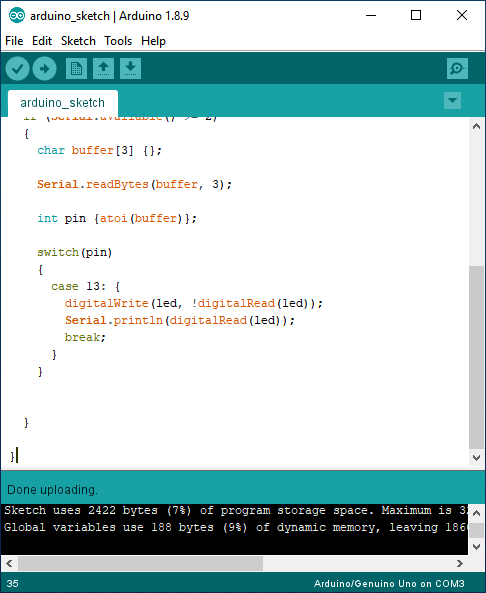

# **How to communicate via a COM port using Python**

Dr Frazer Noble

---

# **Introduction**

In this presentation, I will describe:
- How to communicate via a COM port using Python.

---

# **Getting started**

Create a new directory named "python_serial" in `C:/Users/%USER%/`.

*Note:* Replace `%USER%` with your username.

---


Connect an Arduino to your computer.

Open the Start menu, type "Device Manager", and press <kbd>Enter</kbd>. This will display Windows' Device Manager.

Expand the "Ports" menu to view the Arduino's COM port.

---

Something similar to the following will be displayed:

 
*Figure:* Windows' Device Manager. Here, we can see that an Arduino Uno is connected to the computer. It has enumerated as `COM3`.

---

Open the Arduino IDE.

Open the Start menu, type "Arduino", and press <kbd>Enter</kbd>. This will display the Arduino IDE.

Create a new sketch: Select "File > New" or press <kbd>Ctrl</kbd>+<kbd>N</kbd>.

---

Something similar to the following will be displayed:


*Figure:* Arduino IDE.

---

Type the following C++ program into the file:

```c++
void setup() 
{
  Serial.begin(9600);

  pinMode(13, OUTPUT);
  digitalWrite(13, HIGH);
}
```
---
```c++
void loop() 
{
  if (Serial.available() >= 2)
  {
    char buffer[3] {};
    Serial.readBytes(buffer, 3);
    int pin {atoi(buffer)};

    switch(pin)
    {
      case 13: 
      {
        digitalWrite(13, !digitalRead(led));
        Serial.println(digitalRead(led));
        break;
      }
    }
  }
}
```

---

Save the sketch in `C:\Users\%USER%\python_serial`: either:
1) Select "File > Save";
or,
2) Press <kbd>Ctrl</kbd>+<kbd>S</kbd>, and navigate to `C:\Users\%USER%\python_serial`.

Upload the sketch to the Arduino: either:
1) Select "Sketch > Upload";
or,
2) Press the <kbd>&#8594;</kbd> button.

---

Something similar to the following will be displayed:


*Figure:* Arduino IDE.

---

Open Visual Studio Code in `C:/Users/%USER%/python_serial`: either: 
1) Open Visual Studio Code and select "File > Open Folder..." and navigate to `C:/Users/%USER%/python_serial`; 
or, 
2) Right click in `C:/Users/%USER%/python_serial` and select "Open with Code".

Open a new terminal: either: 
1) press <kbd>Ctrl</kbd>+<kbd>~</kbd>; 
or
2) select "View > Terminal".

---

Create a new virtual environment named "venv".

Type the following command into the terminal and then press <kbd>Enter</kbd>:

```console
python -m venv venv
```

This will create the `venv` virtual environment in `pyside6`.

*Note:* A prompt indicating Visual Studio Code "noticed a new virtual environment" and will ask "if you want to select it for the workspace folder". Press the "Yes" button.

---

Activate the virtual environment.

Type the following command into the terminal and then press <kbd>Enter</kbd>:

```console
.\venv\Scripts\Activate.ps1
```

This will activate the `venv` virtual environment.

*Note:* To deactivate the `venv` virtual environment, type `deactivate` into the terminal and then press <kbd>Enter</kbd>.

---

Install `pyserial`.

Type the following command into the terminal and then press <kbd>Enter</kbd>:

```console
python -m pip install pyserial
```

This will install the latest version of `pyserial` into the `venv` virtual environment.

---

Update `pip`. 

Type the following command into the terminal and then press <kbd>Enter</kbd>:

```console
python -m pip install --upgrade pip
```

This will update `pip` to the latest version.

---

# **`arduino_serial.py`**

Create a new file named "arduino_serial.py" in `C:\Users\%USER%\python_serial`.

Open `arduino_serial.py` and type the following Python code into the file:

```python
import os
import sys

def main():

    return 0

if __name__ == "__main__":

  sys.exit(main())
```

---

In `arduino_serial.py`, type the following Python code:

```python
import serial
from serial.tools.list_ports import comports
```

This will import the `serial` module and serial module's `comports()` function.

The documentation for the `serial` module is available at: [https://pythonhosted.org/pyserial/index.html](https://pythonhosted.org/pyserial/index.html).

---

In `arduino_serial.py`'s `main()` function, type the following Python code:

```python
ser = serial.Serial()
```

This will create an instance of the `Serial` class.

The documentation for the `Serial` class is available at: [https://pythonhosted.org/pyserial/pyserial_api.html](https://pythonhosted.org/pyserial/pyserial_api.html).

---

In `arduino_serial.py`'s `main()` function, type the following Python code:

```python
    print("BAUDRATES:\n{}".format(ser.BAUDRATES))
    print("BYTESIZES:\n{}".format(ser.BYTESIZES))
    print("PARITIES:\n{}".format(ser.PARITIES))
    print("STOPBITS:\n{}".format(ser.STOPBITS))
    print("COMPORTS:\n{}".format([str(c) for c in comports()]))
```

This will display lists of all the baud rates, the data packet sizes, the parities, the number of stop bits, and the name of the devices that can be used. 

---

Type the following command into the terminal and then press <kbd>Enter</kbd>:

```console
python arduino_serial.py
```

This will run `arduino_serial.py`.

---

Something similar to the following will be displayed in the terminal:

```console
BAUDRATES:
(50, 75, 110, 134, 150, 200, 300, 600, 1200, 1800, 2400, 
    4800, 9600, 19200, 38400, 57600, 115200)
BYTESIZES:
(5, 6, 7, 8)
PARITIES:
('N', 'E', 'O', 'M', 'S')
STOPBITS:
(1, 1.5, 2)
COMPORTS:
['COM3 - Arduino Uno (COM3)']
```

Here, we can see the baud rates, the data packet sizes, the parities, the number of stop bits, and the name of the devices that can be used. 

A baud rate of 9600, data packet size of 8 bits, no parity, and 1 stop bit, i.e. `9600 8N1`, is a commonly used combination of values.

---

In `arduino_serial.py`'s `main()` function, type the following Python code:

```python
ser.baudrate = 9600
ser.bytesize = 8
ser.parity = 'N'
ser.stopbits = 1
ser.port = 'COM3'
ser.timeout = 0.5
```

This will set `ser`'s baud rate, data packet size, parity, number of stop bits, device name, and timeout to `9600`, `8`, `None`, `1`, `COM3`, and `0.5` respectively.

---

In `arduino_serial.py`'s `main()` function, type the following Python code:

```python
try:
    ser.open()
except Exception as e:
    print(e)
    return 1
```

This will try to open the `ser`'s port using the assigned baud rate, data packet size, parity, number of stop bits, and device name. Otherwise, an exception is displayed and the program ends.

---

Unplug the Arduino from the computer.

Type the following command into the terminal and then press <kbd>Enter</kbd>:

```console
python arduino_serial.py
```

This will run `arduino_serial.py`.

---

Something similar will be displayed in the terminal:

```console
BAUDRATES:
(50, 75, 110, 134, 150, 200, 300, 600, 1200, 1800, 2400, 
    4800, 9600, 19200, 38400, 57600, 115200)
BYTESIZES:
(5, 6, 7, 8)
PARITIES:
('N', 'E', 'O', 'M', 'S')
STOPBITS:
(1, 1.5, 2)
COMPORTS:
[]
could not open port 'COM3': FileNotFoundError(2, 'The 
    system cannot find the file specified.', None, 2)
```

Plug the Arduino back into the computer.

---

In `arduino_serial.py`'s `main()` function, type the following Python code:

```python
while True:
    pin = input("Enter a pin to toggle (00 - 13), Q/q to break: ")
    
    if pin == 'Q' or pin == 'q':
        break

    data = '{}\n'.format(pin)
    ser.write(data.encode("utf-8"))
    
    data = ser.readline()
    print('{}'.format(data.decode("utf-8")))

ser.close()
```

This will continuously prompt the user to type in a two-digit number, e.g. `13`, which will be encoded into an array of bytes, then written to `ser`'s port. If the user types "Q" or "q", the loop will break, and `ser`'s port will be closed.

---

# **Testing**

Type the following command into the terminal and then press <kbd>Enter</kbd>:

```console
python arduino_serial.py
```

This will run `arduino_serial.py`.

---

Something similar to the following will be displayed in the terminal:

```console
BAUDRATES:
(50, 75, 110, 134, 150, 200, 300, 600, 1200, 1800, 2400, 
    4800, 9600, 19200, 38400, 57600, 115200)
BYTESIZES:
(5, 6, 7, 8)
PARITIES:
('N', 'E', 'O', 'M', 'S')
STOPBITS:
(1, 1.5, 2)
COMPORTS:
['COM3 - Arduino Uno (COM3)']
Enter a pin to toggle (00 - 13), Q/q to break: 13
0
```

Type "13" into the terminal.

Press <kbd>Enter</kbd>.

Type "Q" to quit.

---

  
*Figure:* (Left) The Arduino before data was sent to it; and (Right) the Arduino after the data was received. Before, the LED connected to PIN 13 was ON; afterwards, the LED was toggled OFF.

---

# **Conclusion**

In this presentation, I have described:
- How to communicate via a COM port using Python

---

# **References**

1. [https://www.arduino.cc/](https://www.arduino.cc/)
1. [https://pythonhosted.org/pyserial/index.html](https://pythonhosted.org/pyserial/index.html)
