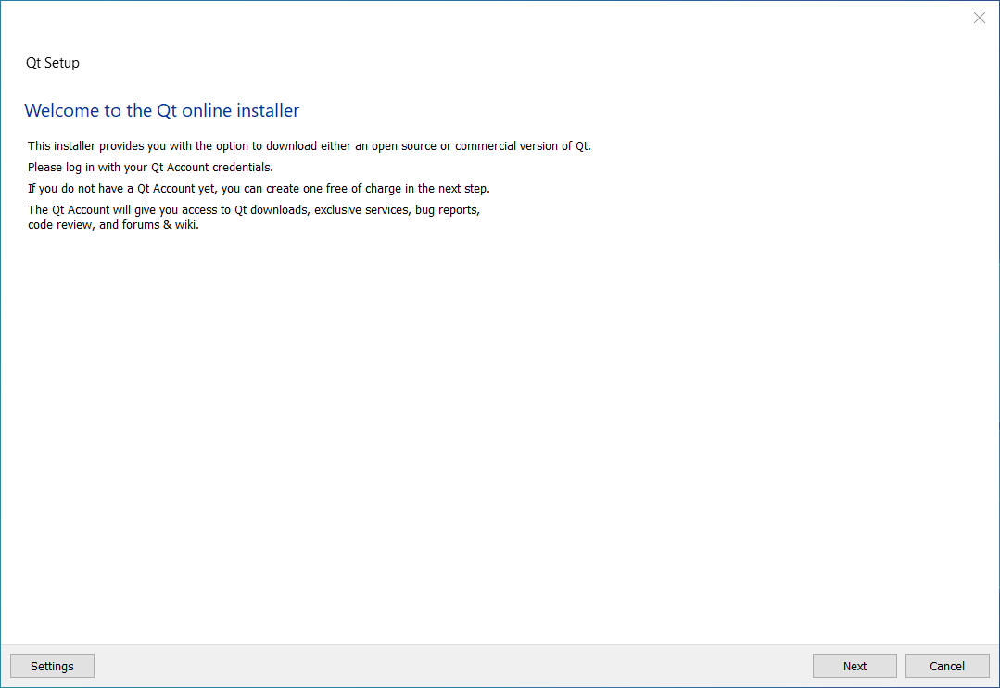
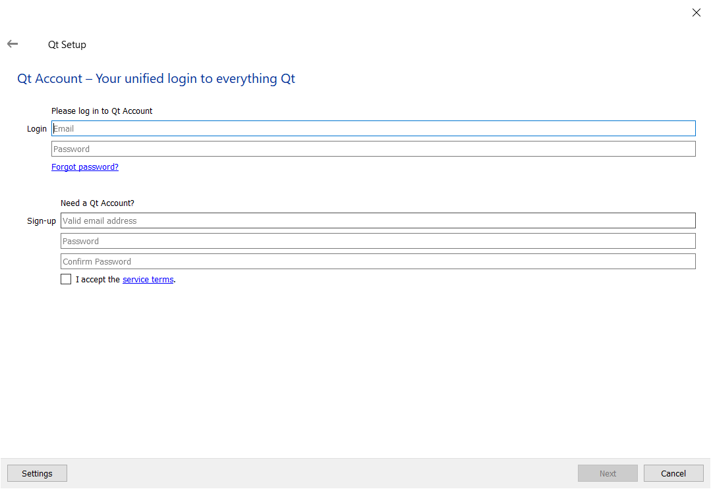
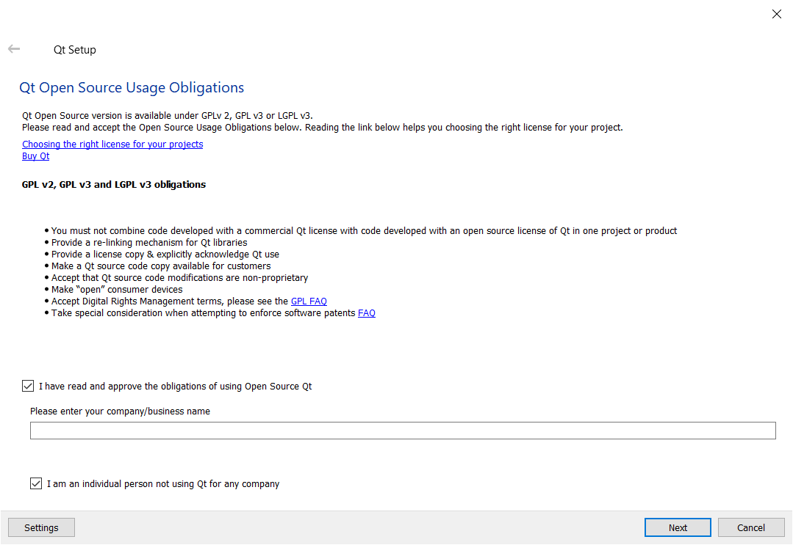
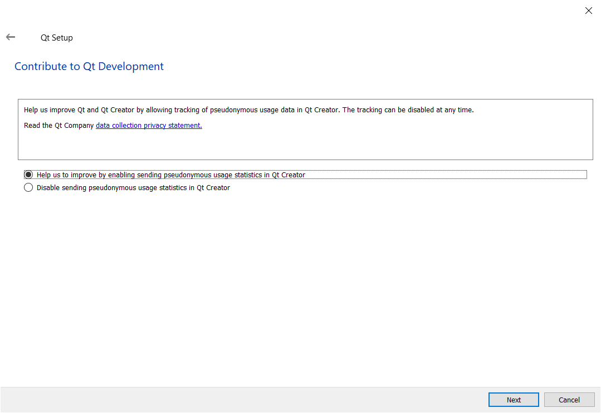
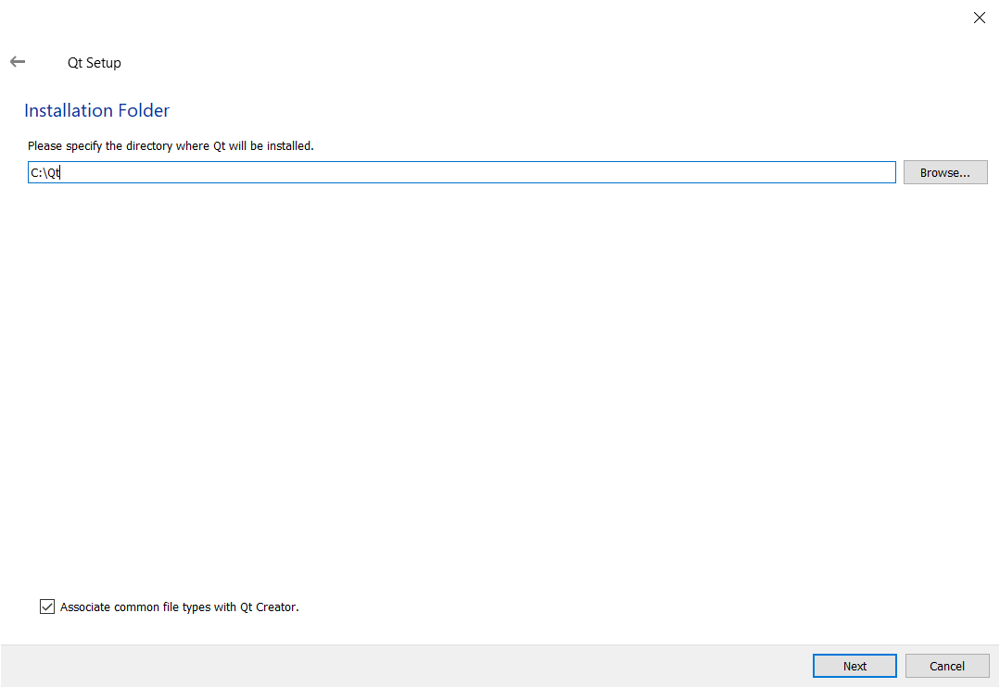
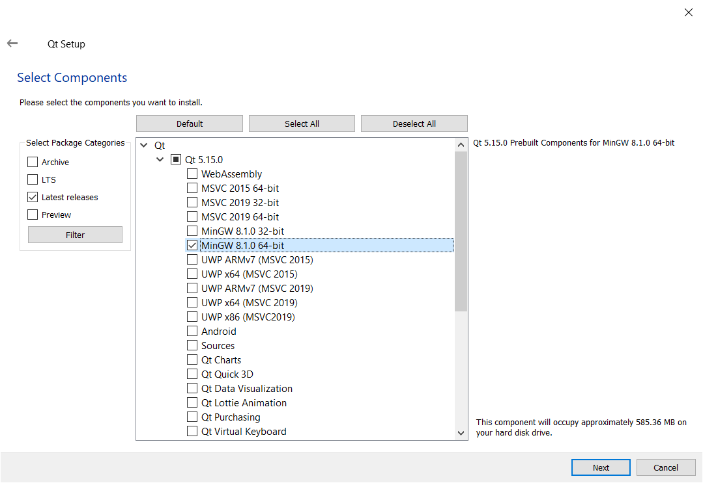
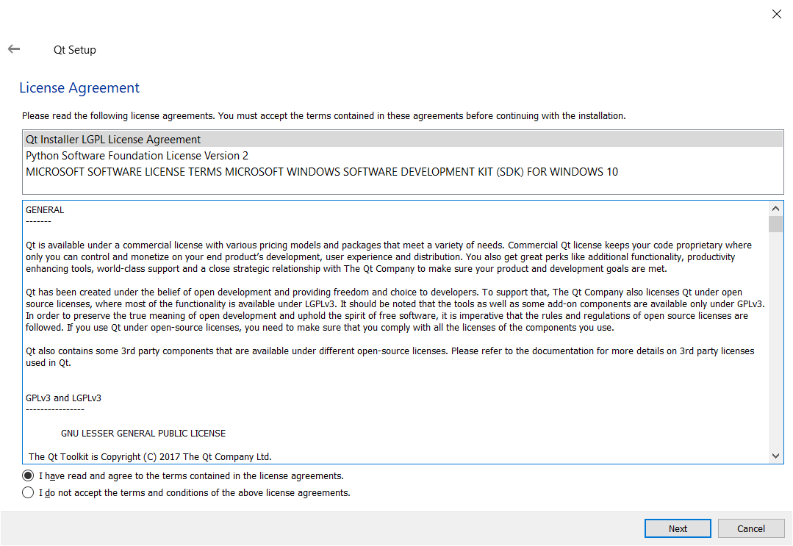
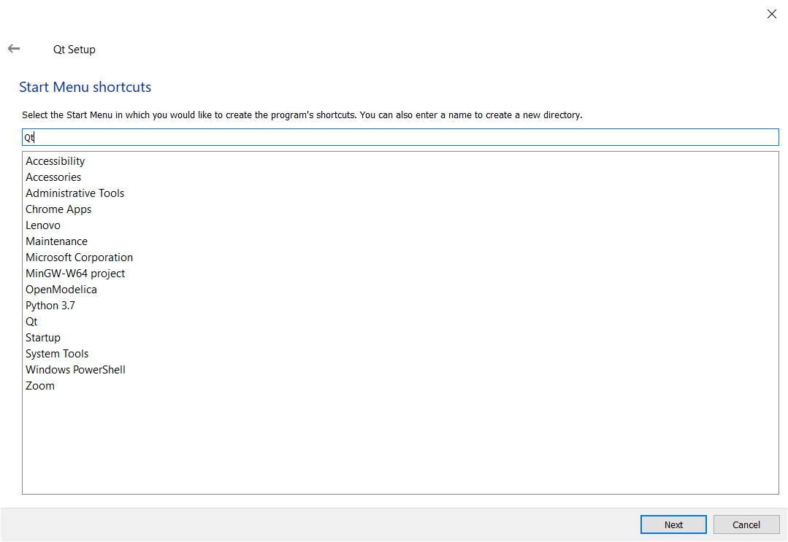
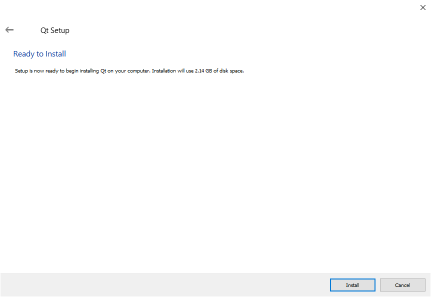

# How to install Qt

 In this guide, I show you how to install Qt.

# Requirements

You need to download Qt from here: [https://www.qt.io/](https://www.qt.io/).

In this guide, I have used the online installer to install Qt 5.15.

# Steps

Follow the below steps to install Qt.

## Step 1

Run the Qt installer. 

When done, you should see the following window:

## Step 2

Left click on the "Next" button.

When done, you should see the following window:

 

## Step 3

Either:

1. Log-in with your Qt Account,  
or
1. Sign-up for a Qt Account.

Left click on the "Next" button.

When done, you should see the following window:

 

## Step 4

Left click on the "I have read and approve the obligations of using Open Source Qt" checkbox. 

Left click on the "I am an individual person not using Qt for any company" checkbox. 

Left click on the "Next" button.

When done, you should see the following window:

 

## Step 5

Left click on the "Help us to improve by enabling sending pseudonymous statistics in Qt Creator" radio button.

Left click on the "Next" button.

When done, you should see the following window:

## Step 6

Left click on the "Next" button.

When done, you should see the following window:

## Step 7

Left click on the arrow next to the Qt 5.15.0 option. 

Left click on the "MinGW 8.1.0 64-bit" option.

I also recommend selecting the "MSVC 2019 64-bit" option.

When done, you should see the following window:

## Step 8

Left click on the "I have read and agree to the terms contained in the license agreements" radio button.

Left click on the "Next" button.

When done, you should see the following window:

## Step 9

Left click on the "Next" button.

When done, you should see the following window:

## Step 10

Left click on the "Install" button.

When done, Qt will begin installing.

## Step 11

Left click on the "Finish" button.

# Conclusion

If you've followed these steps correctly, you have installed Qt.

# Credit

Dr Frazer K. Noble  
Department of Mechanical and Electrical Engineering  
Massey University  
Auckland  
New Zealand  