# **How to communicate via a COM port using Qt**

Dr Frazer Noble

---

# **Introduction**

In this presentation, I will describe:
- How to control an Arduino's pin via a COM port using Qt.

---

# **Getting started**

Create a new directory named "qt_python_serial" in `C:\Users\%USER%/`.

*Note:* Replace `%USER%` with your username.

---

Connect an Arduino to your computer.

Open the Start menu, type "Device Manager", and press <kbd>Enter</kbd>. This will display Windows' Device Manager.

Expand the "Ports" menu to view the Arduino's COM port.

---

Something similar to the following will be displayed:

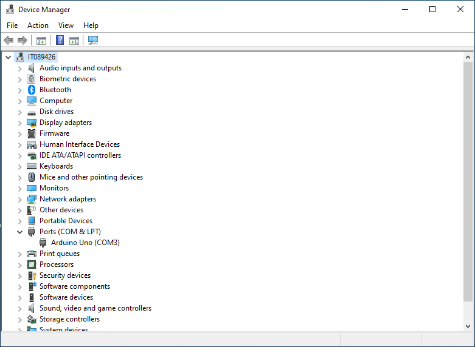 
*Figure:* Windows' Device Manager. Here, we can see that an Arduino Uno is connected to the computer. It has enumerated as `COM3`.

---

Open the Arduino IDE.

Open the Start menu, type "Arduino", and press <kbd>Enter</kbd>. This will display the Arduino IDE.

Create a new sketch: Select "File > New" or press <kbd>Ctrl</kbd>+<kbd>N</kbd>.

---

Something similar to the following will be displayed:

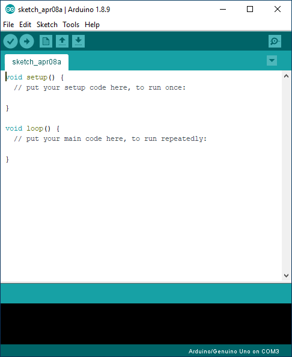
*Figure:* Arduino IDE.

---

Type the following C++ program into the file:

```c++
void setup() 
{
  Serial.begin(9600);

  pinMode(13, OUTPUT);
  digitalWrite(13, HIGH);
}
```
---
```c++
void loop() 
{
  if (Serial.available() >= 2)
  {
    char buffer[3] {};

    Serial.readBytes(buffer, 3);

    int pin {atoi(buffer)};

    switch(pin)
    {
      case 13: 
      {
        digitalWrite(13, !digitalRead(led));
        Serial.println(digitalRead(led));
        break;
      }
    }
  }
}
```

---

Save the sketch in `C:\Users\%USER%\qt_python_serial`: either:
1) Select "File > Save";
or,
2) Press <kbd>Ctrl</kbd>+<kbd>S</kbd>, and navigate to `C:\Users\%USER%\qt_python_serial`.

Upload the sketch to the Arduino: either:
1) Select "Sketch > Upload";
or,
2) Press the <kbd>&#8594;</kbd> button.

---

Something similar to the following will be displayed:


*Figure:* Arduino IDE.

---

Open a new terminal.

Open the Start menu, type "Windows PowerShell", and then select the app.

Type the following command into the terminal and then press press <kbd>Enter</kbd>:

```console
cd C:\Users\%USER%\qt_python_serial
```

This will change the current directory to `C:\Users\%USER%\qt_python_serial`.

---


Create a new virtual environment named "venv".

Type the following command into the terminal and then press <kbd>Enter</kbd>:

```console
python -m venv venv
```

This will create the `venv` virtual environment in `qt_python_serial`.

---

Activate the virtual environment.

Type the following command into the terminal and then press <kbd>Enter</kbd>:

```console
.\venv\Scripts\Activate.ps1
```

This will activate the `venv` virtual environment.

*Note:* To deactivate the `venv` virtual environment, type `deactivate` into the terminal and then press <kbd>Enter</kbd>.

---

Install `pyserial`.

Type the following command into the terminal and then press <kbd>Enter</kbd>:

```console
python -m pip install pyserial
```

This will install the latest version of `pyserial` into the `venv` virtual environment.

---

Install `pyside6`.

Type the following command into the terminal and then press <kbd>Enter</kbd>:

```console
python -m pip install pyside6
```

This will install the latest version of `pyside6` into the `venv` virtual environment.

---

Update `pip`. 

Type the following command into the terminal and then press <kbd>Enter</kbd>:

```console
python -m pip install --upgrade pip
```

This will update `pip` to the latest version.

---

# **Qt Creator**

Open Qt Creator. Either: 
1) Open the Start menu; type "Qt Creator"; and select the app;
or,
2) Browse to `C:\Qt\Tools\QtCreator\bin` and double left click on `qtcreator.exe`.

This will open Qt Creator.

*Note:* `C:\Qt\` is Qt's default installation directory. If you have installed it elsewhere, you will need to browse to that directory instead.

---

Something similar to the following will be displayed:

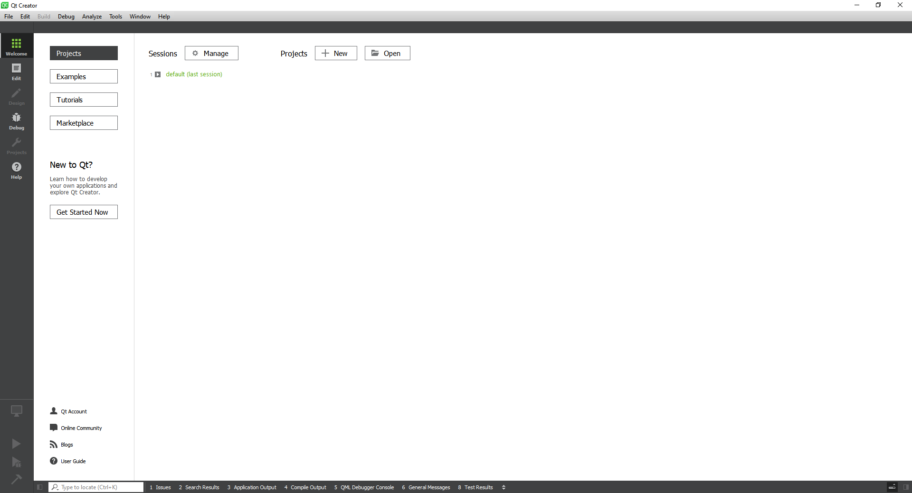
*Figure:* Qt Creator.

Either:

1) Left click on the "New Project" button;
or,
2) Select `File > New Project`;

---

Something similar to the following will be displayed:

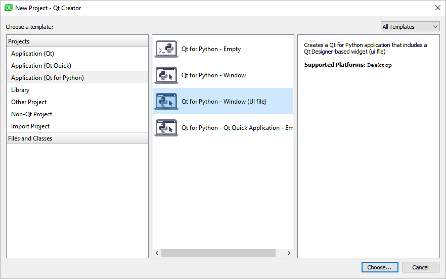
*Figure:* New project window.

Select "Application (Qt for Python)" from the "Project" menu. 

Select "Qt for Python - Window (UI file)".

Left click on the "Choose..." button.

---

Something simiar to the following will be displayed:

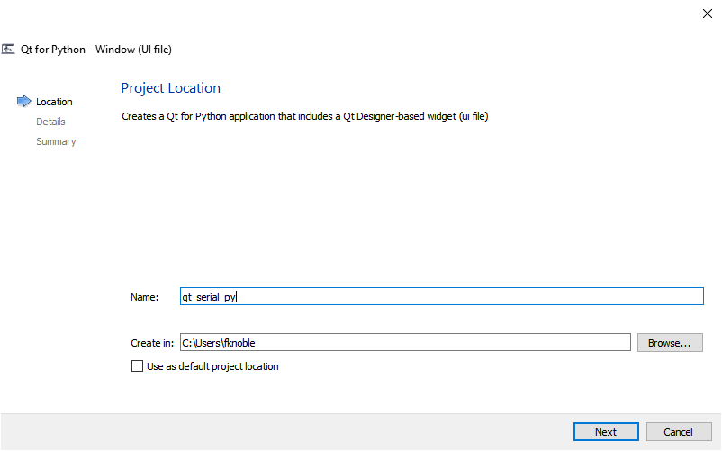
*Figure:* New project window.

Enter "qt_serial_py" for the project's name.

Save the project in `C:\Users\%USER%\qt_python_serial`.

Left click on the "Next" button.

---

Something similar to the following will be displayed:

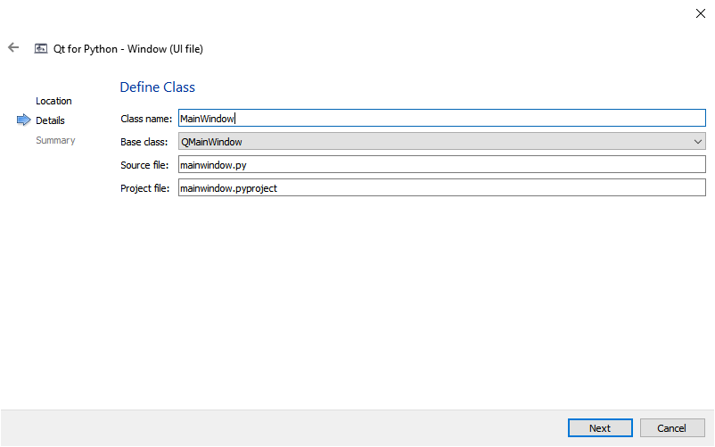
*Figure:* New project window.

Enter "MainWindow" as the class name.

Select `QMainWindow` for the base class.

Left click on the "Next" button.

---

Something similar to the following will be displayed:

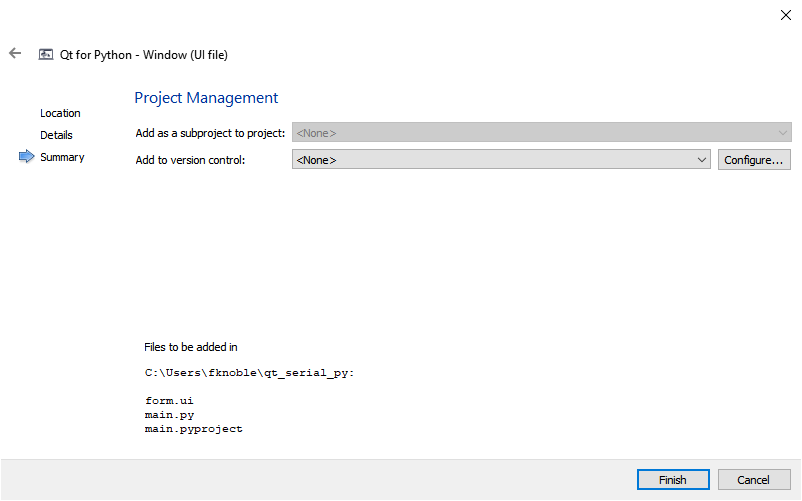
*Figure:* New project window.

Left click on the "Finish" button.

---

Something similar to the following will be displayed:

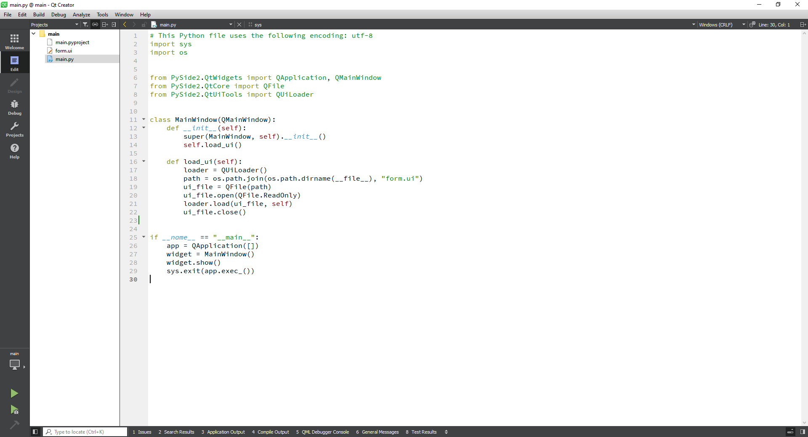
*Figure:* `main.py`.

---

The project consists of the following directories and files:

```console
qt_serial_py/
    .gitignore
    form.ui
    main.py
    main.pyproject
    main.pyproject.user
```

`.gitignore`: A file used by Git to indicate files that should not be included in a repo'.
`form.ui`: A file used by Qt to record the widgets used in the GUI and their properties.
`main.py`: The program's source code.
`main.pyproject`: A file used by Qt to record project settings.
`main.pyproject.user`: A file used by Qt to record user-specific project settings.

---

# **`form.ui`**

Left click on `form.ui` in the "Projects" menu.

Something similar to the following will be displayed:

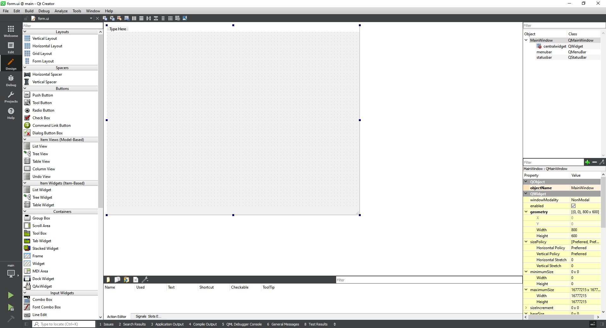
*Figure:* `form.ui`.

---

Resize `form.ui`'s form to 640 x 480 pixels.

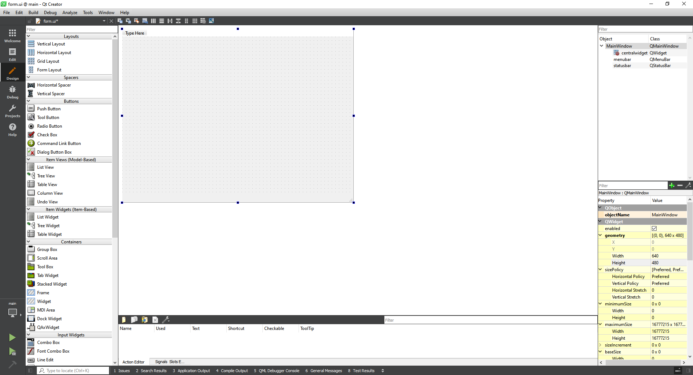
*Figure:* `form.ui`.

---

Drag 3 GroupBox widgets onto `form.ui`'s form as illustrated:


*Figure:* `form.ui`.

---

Drag 1 TextEdit widget onto `form.ui`'s form as illustrated:

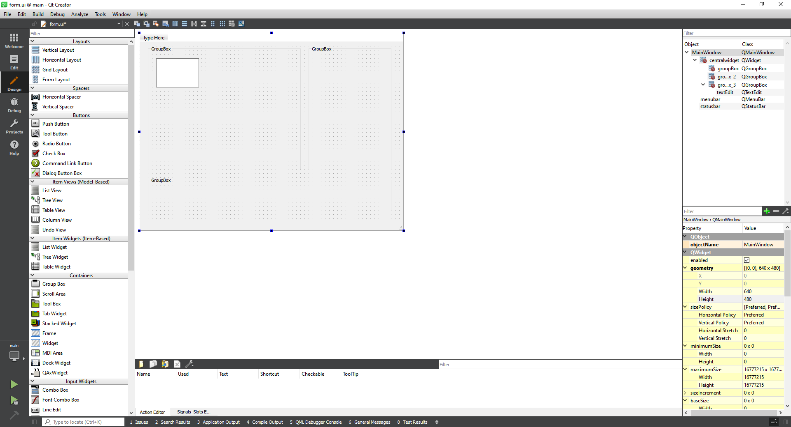
*Figure:* `form.ui`.

---

Drag 6 Label widgets, 6 ComboBox widgets, a PushButton widget, and a VerticalSpacer widget onto `form.ui`'s form as illustrated:

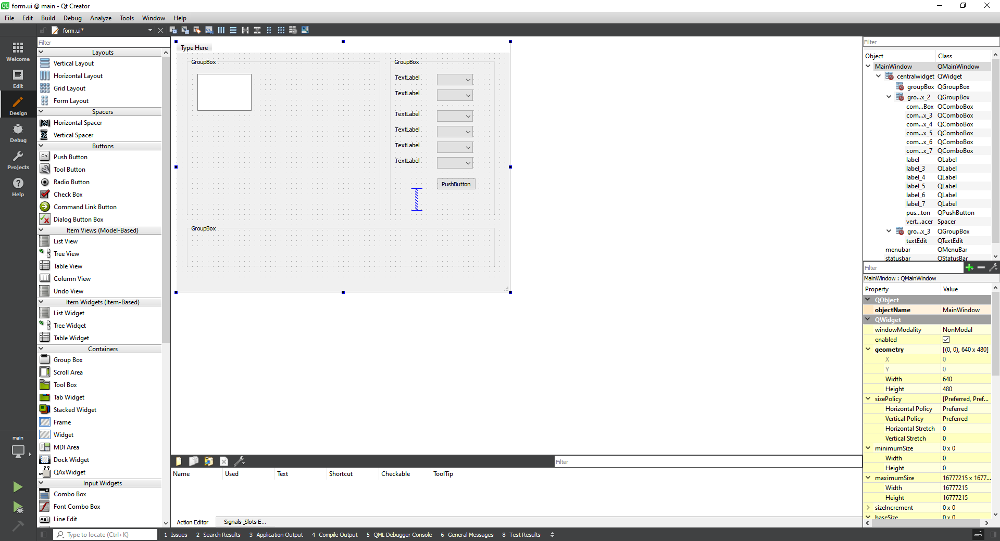
*Figure:* `form.ui`.

---

Drag 1 LineEdit widget, and 1 PushButton widget onto `form.ui`'s form as illustrated:


*Figure:* `form.ui`.

---

Layout the widgets as illustrated:

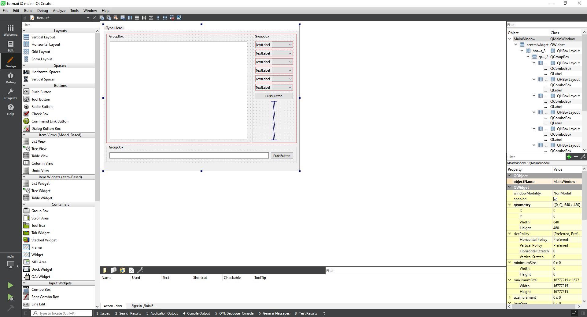
*Figure:* `form.ui`.

---

Change the GroupBox widgets' text as illustrated:


*Figure:* `form.ui`.

Set the "Options" GroupBox's width to 180 px.

Change the TextEdit widget's name to "textEditDisplay".

---

Change the Label, ComboBox, and PushButton widgets' text as illustrated:

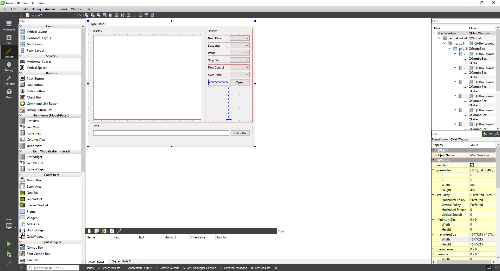
*Figure:* `form.ui`.

Set the ComboBox widgets' width to 75 px. Change the objects' names to "comboBoxBaudRate", "comboBoxDataSize", ..., "comboBoxFlowControl".

Set the "Open" PushButton's width to 75 px. Change the object's name to "pushButtonOpenPort".

---

Change LineEdit and PushButton widgets' text as illustrated.


*Figure:* `form.ui`.

Set the "Send" PushButton's width to 75 px. Change the object's name to "pushButtonSend".

Change the LineEdit's name to "lineEditSend".

---

# **`main.py`**

Left click on `main.py` in the "Projects" menu.

Something similar to the following will be displayed:


*Figure:* `main.py`.

---

Edit `main.py` as illustrated:

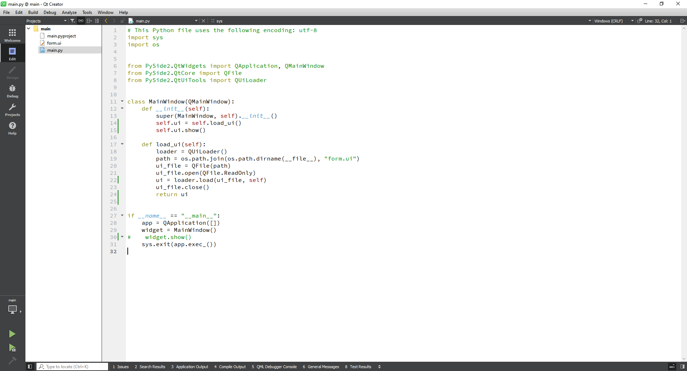
*Figure:* `main.py`.

Change references to `PySide2` to `PySide6`.

---

Either:
1) Left click on the "Run" button;
or,
2) Select "Build > Run".

---

Something similar to the following will be displayed:

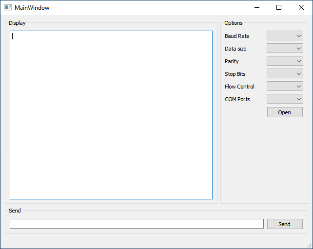
*Figure:* `main.py`'s GUI.

Left click on the "X" button to close the GUI.

---

Import the following additional modules from `PySide6.QtCore`:
- `Signal`, and
- `Slot`.

Add the following Python code to `main.py`:

```python
import serial
import serial.tools.list_ports
```

This will import the `serial` and `serial.tools.list_ports` modules.

---

Add the following Python code to `MainWindow`'s `__init__()` member function:

```python
self.ser = serial.Serial()

self.baudRate = "9600"
self.dataSize = "8"
self.parity = "N"
self.stopBits = "1"
self.flowControl = "False"
self.COMPort = "COM3"
self.timeout = 0.5
```

This will create an instance of the `Serial` class and data members, which are assigned common default values.

---

Add the following Python code to `MainWindow`'s `__init__()` member function:

```python
[self.ui.comboBoxBaudRate.addItem(str(i)) for i in self.ser.BAUDRATES]
self.ui.comboBoxBaudRate.setCurrentText(self.baudRate)
[self.ui.comboBoxDataSize.addItem(str(i)) for i in self.ser.BYTESIZES]
self.ui.comboBoxDataSize.setCurrentText(self.dataSize)
[self.ui.comboBoxParity.addItem(str(i)) for i in self.ser.PARITIES]
self.ui.comboBoxParity.setCurrentText(self.parity)
[self.ui.comboBoxStopBits.addItem(str(i)) for i in self.ser.STOPBITS]
self.ui.comboBoxStopBits.setCurrentText(self.stopBits)
[self.ui.comboBoxFlowControl.addItem(str(i)) for i in [True, False]]
self.ui.comboBoxFlowControl.setCurrentText(self.flowControl)
[self.ui.comboBoxCOMPorts.addItem(str(i)) for i in serial.tools.list_ports.comports()]
self.ui.comboBoxCOMPorts.setCurrentIndex(0)
```

This will populate all the ComboBox widgets with items defined in the `Serial` class's corresponding `enum`s and set the current item to the corresponding data member.

---

Add the following Python code to `MainWindow`'s `__init__()` member function:

```python
self.ui.comboBoxBaudRate.currentTextChanged.connect(self.baudRateChanged)
self.ui.comboBoxDataSize.currentTextChanged.connect(self.dataSizeChanged)
self.ui.comboBoxStopBits.currentTextChanged.connect(self.stopBitsChanged)
self.ui.comboBoxParity.currentTextChanged.connect(self.parityChanged)
self.ui.comboBoxFlowControl.currentTextChanged.connect(self.flowControlChanged)
self.ui.comboBoxCOMPorts.currentTextChanged.connect(self.comPortsChanged)
self.ui.pushButtonOpenPort.clicked.connect(self.open)
self.ui.pushButtonSend.clicked.connect(self.send)
self.ui.lineEditSend.returnPressed.connect(self.send)

self.ui.actionQuit.triggered.connect(self.quit)
```

This will connect each ComboBox widgets' `currentTextChanged` signal to the corresponding slot.

---

Add the following Python code to `main.py`'s `MainWindow` class:

```python
@Slot()
def baudRateChanged(self, text):
    self.baudRate = text
    return

@Slot()
def dataSizeChanged(self, text):
    self.dataSize = text
    return

@Slot()
def stopBitsChanged(self, text):
    self.stopBits = text
    return
```

This will define slots `baudRateChanged()`, `dataSizeChanged()`, and `stopBitsChanged()`, which will assign each ComboBox widget's text to the corresponding data members when signals connected to them are emitted.

---

Add the following Python code to `main.py`'s `MainWindow` class:

```python
@Slot()
def parityChanged(self, text):
    self.parity = text
    return

@Slot()
def flowControlChanged(self, text):
    self.flowControl = text
    return

@Slot()
def comPortsChanged(self, text):
    self.COMPorts = text
    return
```

This will define slots `parityChanged()`, `flowControlChanged()`, and `comPortsChanged()`, which will assign each ComboBox widget's text to the corresponding data members when signals connected to them are emitted.

---

Add the following Python code to `main.py`'s `MainWindow` class:

```python
@Slot()
def open(self):
    if not self.ser.is_open:
        self.ser.baudrate = int(self.baudRate)
        self.ser.bytesize = int(self.dataSize)
        self.ser.parity = self.parity
        self.ser.stopbits = int(self.stopBits)
        if (self.flowControl == "True"):
            self.ser.set_input_flow_control()
            self.ser.set_output_flow_control()
        self.ser.port = self.COMPort
        self.ser.timeout = self.timeout
        self.ser.open()
        self.ui.pushButtonOpenPort.setText("Close")
    else:
        self.ser.close()
        self.ui.pushButtonOpenPort.setText("Open")
    return
```

This will define a slot `open()`, which will open the serial port when a signal connected to it is emitted.

---

Add the following Python code to `main.py`'s `MainWindow` class:

```python
@Slot()
def send(self):
    if self.ser.is_open:
        data = "{}".format(self.ui.lineEditSend.text())
        bytesWritten = self.ser.write(data.encode("utf-8"))
        self.ui.textEditDisplay.append(data)

        data = self.ser.readline()
        self.ui.textEditDisplay.append(data.decode("utf-8"))
    return
```

This will define a slot `send()`, which will write `lineEditSend`'s text to the serial port when a signal connected to it is emitted.

---

Add the following Python code to `main.py`'s `MainWindow` class:

```python
@Slot()
def quit(self):
    QApplication.quit()
    return
```
This will define a slot named `quit()`, which will close the application when a signal connected to it is emitted.

---


Either:
1) Left click on the "Run" button;
or,
2) Select "Build > Run".

---

Something similar to the following will be displayed:


*Figure:* `main.py`'s GUI.

Left click on the "X" button  or select "File > Quit" to close the GUI.

---

# **Testing**

Either:
1) Left click on the "Run" button;
or,
2) Select "Build > Run".

---

Something similar to the following will be displayed:

  
*Figure:* (Left) `main.py`'s GUI; and (Right) the Arduino plugged into the computer. Here, we can see that the LED connected to Pin 13 is ON.

---

Ensure that the default port settings (9600, 8, N, 1, False, COM3) are selected.

Left click on `main.py`'s "Open" button.

Type `13` into `main.py`'s input and then left click on `main.py`'s "Send" button.

---

Something similar to the following will be displayed:

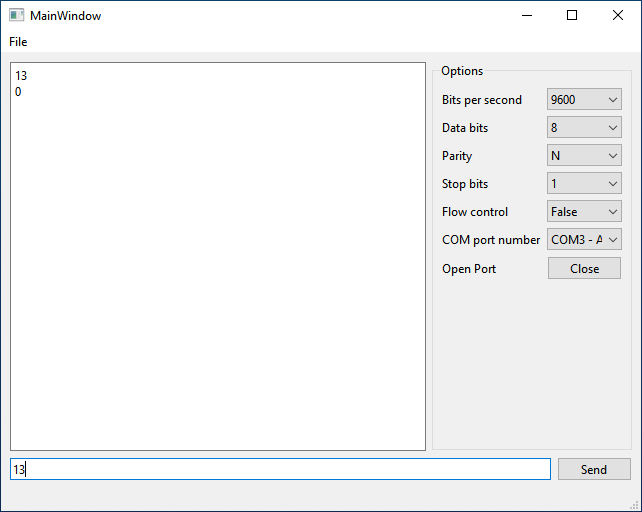  
*Figure:* (Left) `main.py`'s GUI; and (Right) the Arduino plugged into the computer. Here, we can see that the LED connected to Pin 13 is OFF.

The LED has been turned off via a COM port using the GUI!

---

# **Conclusion**

In this presentation, I have described:
- How to control an Arduino's pin via a COM port using Qt.

---

# **References**

1. [https://www.arduino.cc/](https://www.arduino.cc/)
1. [https://doc.qt.io/qtforpython/index.html](https://doc.qt.io/qtforpython/index.html).
1. [https://pythonhosted.org/pyserial/index.html](https://pythonhosted.org/pyserial/index.html)
