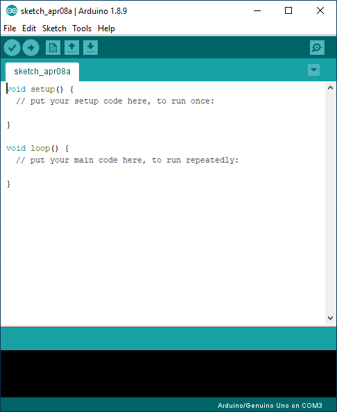
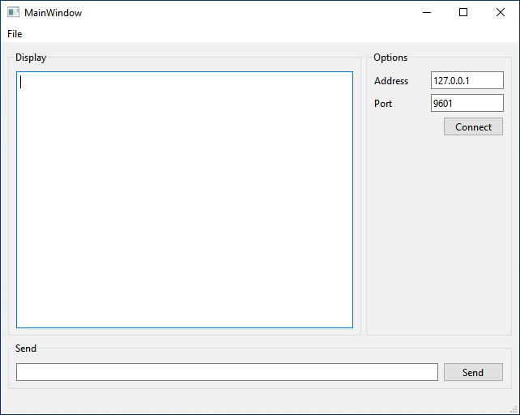
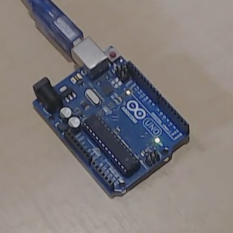

# **How to communicate via a TCP socket using Qt**

Dr Frazer Noble

---

# **Introduction**

In this presentation, I will describe:
- How to control an Arduino's pin via a TCP socket using Qt.

---

# **Getting started**

Create a new directory named "qt_python_TCP" in `C:/Users/%USER%/`.

*Note:* Replace `%USER%` with your username.

---

Connect an Arduino to your computer.

Open the Start menu, type "Device Manager", and press <kbd>Enter</kbd>. This will display Windows' Device Manager.

Expand the "Ports" menu to view the Arduino's COM port.

---

Something similar to the following will be displayed:

 
*Figure:* Windows' Device Manager. Here, we can see that an Arduino Uno is connected to the computer. It has enumerated as `COM3`.

---

Open the Arduino IDE.

Open the Start menu, type "Arduino", and press <kbd>Enter</kbd>. This will display the Arduino IDE.

Create a new sketch: Select "File > New" or press <kbd>Ctrl</kbd>+<kbd>N</kbd>.

---

Something similar to the following will be displayed:


*Figure:* Arduino IDE.

---

Type the following C++ program into the file:

```c++
void setup() 
{
  Serial.begin(9600);

  pinMode(13, OUTPUT);
  digitalWrite(13, HIGH);
}
```
---
```c++
void loop() 
{
  if (Serial.available() >= 2)
  {
    char buffer[3] {};

    Serial.readBytes(buffer, 3);

    int pin {atoi(buffer)};

    switch(pin)
    {
      case 13: 
      {
        digitalWrite(13, !digitalRead(led));
        Serial.println(digitalRead(led));
        break;
      }
    }
  }
}
```

---

Save the sketch in `C:\Users\%USER%\qt_python_TCP`: either:
1) Select "File > Save";
or,
2) Press <kbd>Ctrl</kbd>+<kbd>S</kbd>, and navigate to `C:\Users\%USER%\qt_python_TCP`.

Upload the sketch to the Arduino: either:
1) Select "Sketch > Upload";
or,
2) Press the <kbd>&#8594;</kbd> button.

---

Something similar to the following will be displayed:


*Figure:* Arduino IDE.

---

Open Visual Studio Code in `C:/Users/%USER%/qt_python_TCP`: either: 
1) Open Visual Studio Code and select "File > Open Folder..." and navigate to `C:/Users/%USER%/qt_python_TCP`; 
or, 
2) Right click in `C:/Users/%USER%/qt_python_TCP` and select "Open with Code".

Open a new terminal: either: 
1) press <kbd>Ctrl</kbd>+<kbd>~</kbd>; 
or
2) select "View > Terminal".

---

Create a new virtual environment named "venv".

Type the following command into the terminal and then press <kbd>Enter</kbd>:

```console
python -m venv venv
```

This will create the `venv` virtual environment in `pyside6`.

*Note:* A prompt indicating Visual Studio Code "noticed a new virtual environment" and will ask "if you want to select it for the workspace folder". Press the "Yes" button.

---

Activate the virtual environment.

Type the following command into the terminal and then press <kbd>Enter</kbd>:

```console
.\venv\Scripts\Activate.ps1
```

This will activate the `venv` virtual environment.

*Note:* To deactivate the `venv` virtual environment, type `deactivate` into the terminal and then press <kbd>Enter</kbd>.

---

Install `pyside6`.

Type the following command into the terminal and then press <kbd>Enter</kbd>:

```console
python -m pip install pyside6
```

This will install the latest version of `pyside6` into the `venv` virtual environment.

---

Install `pyserial`.

Type the following command into the terminal and then press <kbd>Enter</kbd>:

```console
python -m pip install pyserial
```

This will install the latest version of `pyserial` into the `venv` virtual environment.

---

Update `pip`. 

Type the following command into the terminal and then press <kbd>Enter</kbd>:

```console
python -m pip install --upgrade pip
```

This will update `pip` to the latest version.

---

# **Qt Designer**

Type the following command into the terminal and then press <kbd>Enter</kbd>:

```console
pyside6-designer
```

This will start Qt Designer.

---

Something similar to the following will be displayed:


*Figure:* Qt Designer.

Left click on "Main Window" in the "templates\forms" menu.

Left click on the "Create" button.

---

Something similar to the following will be displayed:


*Figure:* Qt Designer.

---

# **`client.ui`**

Save the project as "client.ui" in `C:/Users/%USER%/qt_python_TCP`. Either: 
1) Press the "Save" button;
or,
2) Select "File > Save".

---

Resize `client.ui`'s form to 640 x 480 pixels.


*Figure:* `client.ui`.

---

Drag 3 GroupBox widgets onto `client.ui`'s form as illustrated:


*Figure:* `client.ui`.

---

Drag 1 TextEdit widget onto `client.ui`'s form as illustrated:


*Figure:* `client.ui`.

---

Drag 2 Label widgets, 2 LineEdit widgets, a PushButton widget, a HorizontalSpacer widget, and a VerticalSpacer widget onto `client.ui`'s form as illustrated:


*Figure:* `client.ui`.

---

Drag 1 LineEdit widget, and 1 PushButton widget onto `client.ui`'s form as illustrated:


*Figure:* `client.ui`.

---

Layout the widgets as illustrated:


*Figure:* `client.ui`.

---

Change the GroupBox widgets' text as illustrated:


*Figure:* `client.ui`.

Set the "Options" GroupBox's width to 180 px.

Change the TextEdit widget's name to "textEditDisplay".

---

Change the Label, LineEdit, and PushButton widgets' text as illustrated:


*Figure:* `client.ui`.

Set the LineEdit widgets' width to 100 px. Change the objects' names to "lineEditAddress" and "lineEditPort"

Set the "Connect" PushButton's width to 75 px. Change the object's name to "pushButtonConnect".

---

Change LineEdit and PushButton widgets' text as illustrated.


*Figure:* `form.ui`.

Set the "Send" PushButton's width to 75 px. Change the object's name to "pushButtonSend".

Change the LineEdit's name to "lineEditSend".

---

# **`tcp_client.py`**

Create a new file named "tcp_client.py" in `C:/Users/%USER%/qt_python_TCP`.

Open `tcp_client.py` and type the following Python code into the file:

```python
import os
import sys

from PySide6.QtWidgets import QApplication, QMainWindow
from PySide6.QtCore import qDebug, QFile, Signal, Slot
from PySide6.QtUiTools import QUiLoader
```
---
```
class MainWindow(QMainWindow):
    def __init__(self):
        super(MainWindow, self).__init__()
        self.ui = self.load_ui()
        self.ui.show()

    def load_ui(self):
        loader = QUiLoader()
        path = os.path.join(os.path.dirname(__file__), "client.ui")
        ui_file = QFile(path)
        ui_file.open(QFile.ReadOnly)
        ui = loader.load(ui_file, self)
        ui_file.close()
        return ui
```
---
```python
if __name__ == "__main__":

    app = QApplication([])

    window = MainWindow()

    sys.exit(app.exec_())
```

---

Type the following command into the terminal and then press <kbd>Enter</kbd>:

```console
python tcp_client.py
```

This will run `tcp_client.py`.

---

Something similar to the following will be displayed:


*Figure:* `tcp_client.py`'s GUI.

---

Add the following Python code to `tcp_client.py`:

```python
from PySide6.QtNetwork import QHostAddress, QTcpSocket
```

This will import the `QHostAddress` and `QTcpSocket` classes from Qt's `QtNetwork` module.

---

Add the following Python code to `MainWindow`'s `__init__()` member function:

```python
self.socket = QTcpSocket()

self.ui.pushButtonConnect.clicked.connect(self.connect)
self.ui.pushButtonSend.clicked.connect(self.send)
self.ui.lineEditSend.returnPressed.connect(self.send)

self.ui.actionQuit.triggered.connect(self.quit)

self.socket.connected.connect(self.onConnection)
```

This will create an instance of the `QTcpSocket` class and connect the GUI and socket's signals to appropriate slots.

---

Add the following Python code to `tcp_client.py`'s `MainWindow` class:

```python
@Slot()
def send(self):
    if self.socket.state() == QTcpSocket.ConnectedState:
        message = self.ui.lineEditSend.text()
        self.ui.textEditDisplay.append(message)
        self.socket.write(message.encode("utf-8"))
    return
```

This will define a slot named `send()`, which will write data to a socket when a signal connected to it is emitted.

---

Add the following Python code to `tcp_client.py`'s `MainWindow` class:

```python
@Slot()
def connect(self):
    if self.ui.pushButtonConnect.text() == "Connect":
        address = self.ui.lineEditAddress.text()
        port = self.ui.lineEditPort.text()
        self.socket.connectToHost(QHostAddress(address), int(port))
    else:
        self.ui.pushButtonConnect.setText("Connect")
        self.socket.close()
    return
```

This will define a slot named `connect()`, which will connect to a server when a signal connected to it is emitted.

---

Add the following Python code to `tcp_client.py`'s `MainWindow` class:

```python
@Slot()
def onConnection(self):
    self.ui.pushButtonConnect.setText("Disconnect")
    address = self.ui.lineEditAddress.text()
    port = self.ui.lineEditPort.text()
    message = "Connected to host <{}:{}>".format(address, port)
    self.ui.textEditDisplay.append(message)
    return
```

This will define a slot named `onConnection()`, which will display a message when a signal connected to it is emitted.

---

Add the following Python code to `tcp_client.py`'s `MainWindow` class:

```python
@Slot()
def quit(self):
    QApplication.quit()
    return
```

This will define a slot named `quit()`, which will close the application when a signal connected to it is emitted.

---

# **Qt Designer**

Type the following command into the terminal and then press <kbd>Enter</kbd>:

```console
pyside6-designer
```

This will start Qt Designer.

---

Something similar to the followig will be displayed:


*Figure:* Qt Designer.

Left click on "Main Window" in the "templates\forms" menu.

Left click on the "Create" button.

---

Something similar to the following will be displayed:


*Figure:* Qt Designer.

---

# **`server.ui`**

Save the project as "server.ui" in `C:/Users/%USER%/qt_python_TCP`. Either: 
1) Press the "Save" button;
or,
2) Select "File > Save".

---

Resize `server.ui`'s form to 640 x 480 pixels.


*Figure:* `server.ui`.

---

Drag 2 GroupBox widgets onto `server.ui`'s form as illustrated:


*Figure:* `server.ui`.

---

Drag 1 TextEdit widget onto `server.ui`'s form as illustrated:


*Figure:* `server.ui`.

---

Drag 8 Label widgets, 2 LineEdit widgets, 6 ComboBox widgets, a PushButton widget, a HorizontalSpacer widget, and a VerticalSpacer widget onto `server.ui`'s form as illustrated:


*Figure:* `server.ui`.

---

Layout the widgets as illustrated:


*Figure:* `server.ui`.

---

Change the GroupBox widgets' text as illustrated:


*Figure:* `server.ui`.

Set the "Options" GroupBox's width to 180 px.

Change the TextEdit widget's name to "textEditDisplay".

---

Change the Label, LineEdit, CombBox, and PushButton widgets' text as illustrated:


*Figure:* `server.ui`.

---

Set the LineEdit widgets' width to 100 px. Change the objects' names to "lineEditAddress" and "lineEditPort"

Set the ComboBox widgets' width to 75 px. Change the objects' names to "comboBoxBaudRate", "comboBoxDataSize", ..., "comboBoxFlowControl".

Set the "Connect" PushButton's width to 75 px. Change the object's name to "pushButtonConnect".

---

# **`tcp_server.py`**


Create a new file named "tcp_server.py" in `C:/Users/%USER%/qt_python_TCP`.

Open `tcp_server.py` and type the following Python code into the file:

```python
import os
import sys

from PySide6.QtWidgets import QApplication, QMainWindow
from PySide6.QtCore import qDebug, QFile, Signal, Slot
from PySide6.QtUiTools import QUiLoader
```
---
```
class MainWindow(QMainWindow):
    def __init__(self):
        super(MainWindow, self).__init__()
        self.ui = self.load_ui()
        self.ui.show()

    def load_ui(self):
        loader = QUiLoader()
        path = os.path.join(os.path.dirname(__file__), "server.ui")
        ui_file = QFile(path)
        ui_file.open(QFile.ReadOnly)
        ui = loader.load(ui_file, self)
        ui_file.close()
        return ui
```
---
```python
if __name__ == "__main__":

    app = QApplication([])

    window = MainWindow()

    sys.exit(app.exec_())
```

---

Type the following command into the terminal and then press <kbd>Enter</kbd>:

```console
python tcp_server.py
```

This will run `tcp_server.py`.

---

Something similar to the following will be displayed:


*Figure:* `tcp_server.py`'s GUI.

---

Add the following Python code to `tcp_server.py`:

```python
from PySide6.QtNetwork import QHostAddress, QTcpServer, QTcpSocket

import serial
import serial.tools.list_ports
```

This will import the `QHostAddress`, `QTcpServer`, and `QTcpSocket` classes from Qt's `QtNetwork` module. 

It will also import the `serial` and `serial.tools.list_ports` modules.

---

Add the following Python code to `MainWindow`'s `__init__()` member function: 

```python
self.ser = serial.Serial()

self.baudRate = "9600"
self.dataSize = "8"
self.parity = "N"
self.stopBits = "1"
self.flowControl = "False"
self.COMPort = "COM3"
self.timeout = 2.0

self.server = QTcpServer()
self.socket = QTcpSocket()
```

This will create an instance of the `Serial` class and data members, which are assigned common default values.

It will also create instances of the `QTcpServer` and `QTcpSocket` classes.

---

Add the following Python code to `MainWindow`'s `__init__()` member function: 

```python
[self.ui.comboBoxBaudRate.addItem(str(i)) for i in self.ser.BAUDRATES]
self.ui.comboBoxBaudRate.setCurrentText(self.baudRate)
[self.ui.comboBoxDataSize.addItem(str(i)) for i in self.ser.BYTESIZES]
self.ui.comboBoxDataSize.setCurrentText(self.dataSize)
[self.ui.comboBoxParity.addItem(str(i)) for i in self.ser.PARITIES]
self.ui.comboBoxParity.setCurrentText(self.parity)
[self.ui.comboBoxStopBits.addItem(str(i)) for i in self.ser.STOPBITS]
self.ui.comboBoxStopBits.setCurrentText(self.stopBits)
[self.ui.comboBoxFlowControl.addItem(str(i)) for i in [True, False]]
self.ui.comboBoxFlowControl.setCurrentText(self.flowControl)
[self.ui.comboBoxCOMPorts.addItem(str(i)) for i in serial.tools.list_ports.comports()]
self.ui.comboBoxCOMPorts.setCurrentIndex(0)
```

This will populate all the ComboBox widgets with items defined in the `Serial` class's corresponding `enum`s and set the current item to the corresponding data member.

---

Add the following Python code to `MainWindow`'s `__init__()` member function: 

```python
self.ui.comboBoxBaudRate.currentTextChanged.connect(self.baudRateChanged)
self.ui.comboBoxDataSize.currentTextChanged.connect(self.dataSizeChanged)
self.ui.comboBoxStopBits.currentTextChanged.connect(self.stopBitsChanged)
self.ui.comboBoxParity.currentTextChanged.connect(self.parityChanged)
self.ui.comboBoxFlowControl.currentTextChanged.connect(self.flowControlChanged)
self.ui.comboBoxCOMPorts.currentTextChanged.connect(self.comPortsChanged)
self.ui.pushButtonStart.clicked.connect(self.start)

self.ui.actionQuit.triggered.connect(self.quit)

self.server.newConnection.connect(self.acceptConnection)
```

This will connect the GUI and server's signals to appropriate slots.

---

Add the following Python code to `tcp_server.py`'s `MainWindow` class:

```python
@Slot()
def baudRateChanged(self, text):
    self.baudRate = text
    return

@Slot()
def dataSizeChanged(self, text):
    self.dataSize = text
    return

@Slot()
def stopBitsChanged(self, text):
    self.stopBits = text
    return
```

This will define slots `baudRateChanged()`, `dataSizeChanged()`, and `stopBitsChanged()`, which will assign each ComboBox widget's text to the corresponding data members when signals connected to them are emitted.

---

Add the following Python code to `tcp_server.py`'s `MainWindow` class:

```python
@Slot()
def parityChanged(self, text):
    self.parity = text
    return

@Slot()
def flowControlChanged(self, text):
    self.flowControl = text
    return

@Slot()
def comPortsChanged(self, text):
    self.COMPorts = text
    return
```

This will define slots `parityChanged()`, `flowControlChanged()`, and `comPortsChanged()`, which will assign each ComboBox widget's text to the corresponding data members when signals connected to them are emitted.

---

Add the following Python code to `tcp_server.py`'s `MainWindow` class:

```python
@Slot()
def start(self):
    if self.ui.pushButtonStart.text() == "Start":
        self.ui.pushButtonStart.setText("Stop")
        address = self.ui.lineEditAddress.text()
        port = self.ui.lineEditPort.text()
        self.server.listen(QHostAddress(address), int(port))
        message = "Server waiting for messages <{}:{}>".format(address, int(port))
        self.ui.textEditDisplay.append(message)
```
---
```python
        self.ser.baudrate = int(self.baudRate)
        self.ser.bytesize = int(self.dataSize)
        self.ser.parity = self.parity
        self.ser.stopbits = int(self.stopBits)
        if (self.flowControl == "True"):
            self.ser.set_input_flow_control()
            self.ser.set_output_flow_control()
        self.ser.port = self.COMPort
        self.ser.timeout = self.timeout
        self.ser.open()
    else:
        self.ui.pushButtonStart.setText("Start")
        self.server.close()
        self.socket.close()

        self.ser.close()
    return
```

This will define a slot named `start()`, which will start a TCP server and connect to a port when a signal connected to it is emitted.

---

Add the following Python code to `tcp_server.py`'s `MainWindow` class:

```python
@Slot()
def acceptConnection(self):
    self.socket = self.server.nextPendingConnection()
    self.socket.readyRead.connect(self.readMessage)
    return
```

This will define a slot named `acceptConnection()`, which will get an available socket when a signal connected to it is emitted.

---

Add the following Python code to `tcp_server.py`'s `MainWindow` class:

```python
@Slot()
def readMessage(self):
    buffer = self.socket.readAll()
    bytesRead = buffer.length()
    message = "Message: {} ({} bytes)".format(buffer, bytesRead)
    self.ui.textEditDisplay.append(message)
    self.ser.write(buffer)
    buffer = self.ser.readline()
    self.ui.textEditDisplay.append(buffer.decode("utf-8"))
    return
```

This will define a slot named `readMessage()`, which will read a message from the socket, display it in `tcp_server.py`'s output, and write it to the port when a signal connect to it is emitted.

---

Add the following Python code to `tcp_server.py`'s `MainWindow` class:

```python
@Slot()
def quit(self):
    QApplication.quit()
    return
```
This will define a slot named `quit()`, which will close the application when a signal connected to it is emitted.

---

# **Testing**

Type the following command into the terminal and then press <kbd>Enter</kbd>:

```console
python tcp_client.py
```

This will run `tcp_client.py`.

Open a new terminal.

Type the following command into the new terminal and then press <kbd>Enter</kbd>:

```console
python tcp_server.py
```

This will run `tcp_server.py`.

---

Something similar to the following will be displayed:

  
*Figure:* (Left) `tcp_client.py`'s GUI; (Centre) `tcp_server.py`'s GUI; and (Right) the Arduino plugged into the computer. Here, we can see that the LED connected to PIN 13 is ON.

Ensure that the default port settings (9600, 8, N, 1, False, COM3) are selected.

Left click on `tcp_server.py`'s "Start" button.

Left click on `tcp_client.py`'s "Connect" button.

---

Something similar to the following will be displayed:

  
*Figure:* (Left) `tcp_client.py`'s GUI; (Centre) `tcp_server.py`'s GUI; and (Right) the Arduino plugged into the computer. Here, we can see that the LED connected to PIN 13 is ON.

Type `13` into `tcp_client.py`'s input and then left click on the `tcp_client.py`'s "Send" button.

---

Something similar to the following will be displayed:

  
*Figure:* (Left) `tcp_client.py`'s GUI; (Centre) `tcp_server.py`'s GUI; and (Right) the Arduino plugged into the computer. Here, we can see that the LED connected to PIN 13 is OFF.

The LED has been turned off via a TCP socket using the GUI!

---

# **Conclusion**

In this presentation, I have described:
- How to control an Arduino's pin via a TCP socket using Qt.

---

# **References**

1. [https://www.arduino.cc/](https://www.arduino.cc/)
1. [https://doc.qt.io/qtforpython/index.html](https://doc.qt.io/qtforpython/index.html).
1. [https://pythonhosted.org/pyserial/index.html](https://pythonhosted.org/pyserial/index.html)
